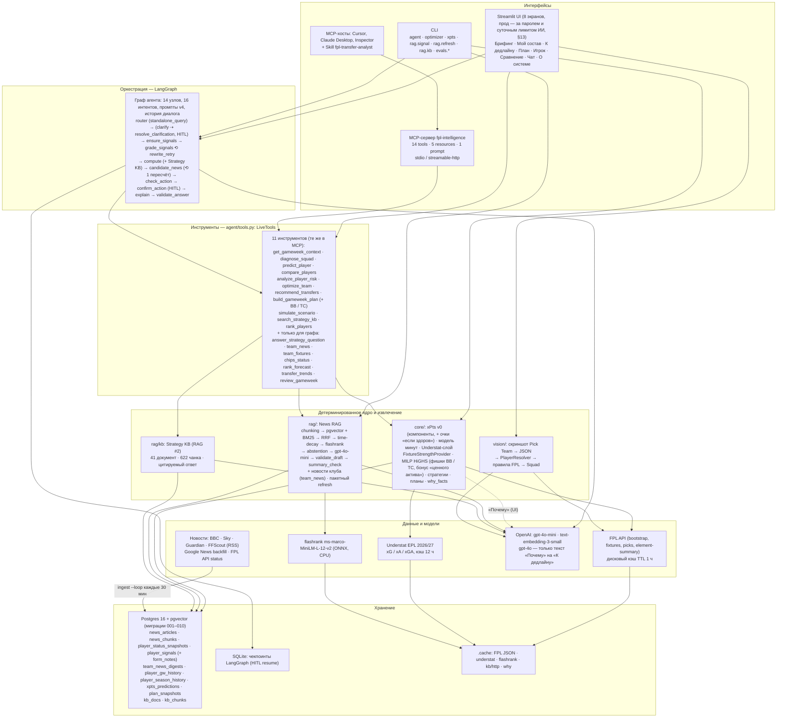
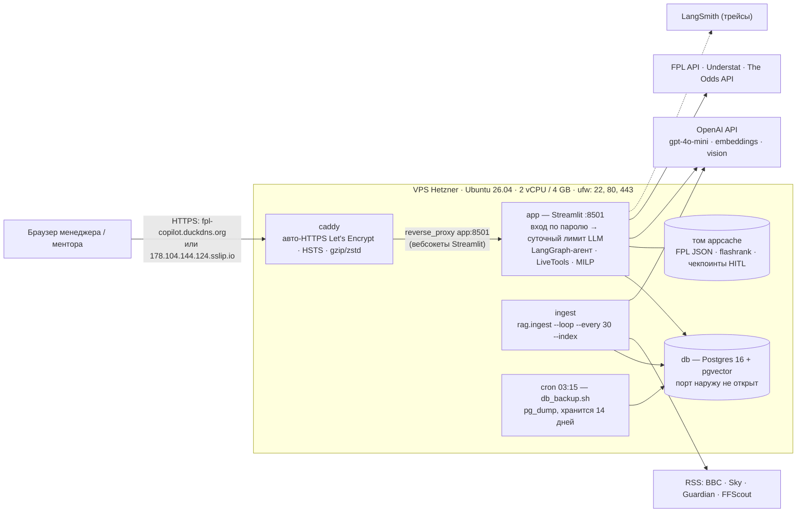

# ARCHITECTURE — FPL Copilot

Документ описывает, как устроена система. Каждое утверждение ниже опирается на код в `src/fplcopilot/` и на подробные
документы по компонентам: [`docs/sources.md`](sources.md), [`docs/rag.md`](rag.md),
[`docs/xpts.md`](xpts.md), [`docs/optimizer.md`](optimizer.md), [`docs/agent.md`](agent.md),
[`docs/mcp.md`](mcp.md), [`docs/vision.md`](vision.md), [`docs/strategy_kb.md`](strategy_kb.md),
[`docs/ui.md`](ui.md), [`docs/EVALS.md`](EVALS.md), [`docs/LLM_CHOICE.md`](LLM_CHOICE.md),
[`docs/chat_diagnosis.md`](chat_diagnosis.md). Числа
приведены с указанием документа-источника; где что-то не сделано — так и написано.

Исходники диаграмм (mermaid) лежат в [`docs/diagrams/`](diagrams/):
`architecture.mmd` (слои), `request_path.mmd` (путь запроса), `data_flow.mmd` (офлайн/онлайн),
`data_model.mmd` (таблицы), `agent_graph.mmd` (граф LangGraph, сгенерирован кодом),
`deploy.mmd` (прод-стек, §13). Упрощённая схема для защиты — `overview.png` и слайд 6
презентации [`docs/presentation/FPL_Copilot_defense.pdf`](presentation/FPL_Copilot_defense.pdf).

## 1. Принцип, из которого следует всё остальное

> LLM маршрутизирует, извлекает и объясняет. Считает детерминированный код.

Это правило выполняется без исключений:

| задача | кто решает | где |
|---|---|---|
| понять вопрос (в чате — с учётом 6 последних реплик: уточнение переписывается в самостоятельный вопрос), вытащить имена, сценарий, тур, фишки | LLM (`gpt-4o-mini`, structured output, T = 0, промпт v4) | `agent/llm.py: router_llm`, `agent/chat.py` |
| кто такой «Palmer» / «Палмер» | код (матчер сущностей, контекст состава, владение; кириллица — фонетический ключ) | `agent/resolve.py`, `agent/translit.py` |
| что пишут о травме игрока → структурированный сигнал | гибридный поиск + LLM-извлечение + валидатор цитат и summary кодом | `rag/retrieve.py`, `rag/extract.py`, `rag/summary_check.py` |
| кто из клуба выбыл и до какого тура; что говорит тренер | выбывшие — код по статусам FPL и календарю; мягкий контекст — LLM-дайджест с проверкой цитат кодом | `rag/team_news.py` |
| ожидаемые очки игрока на тур | компонентная модель xPts v0 (без LLM) | `core/xpts.py`, `core/minutes.py` |
| лучшие 11, трансферы, план на 5 туров, хит или нет | MILP (PuLP + HiGHS) | `core/optimizer.py` |
| придержать травмированного топ-игрока, купить того, кого сбрасывают из-за лёгкой травмы | код: очки «если здоров», пороги позиции, бонус в цель MILP (`asset_bonus`) | `core/assets.py`, `core/minutes.py: fit_minutes`, `docs/optimizer.md` |
| «План на тур» на «К дедлайну»: что сделать и почему, цена продажи против выкупа | код по выходам инструментов, без LLM; цены продажи — по истории трансферов и правилу FPL | `app/deadline_plan.py`, `data/prices.py` |
| лента новостей на «Брифинге» | код: сохранённые разборы сигналов по составу + свежие заголовки корпуса с оценкой по ключевым словам и источнику, без LLM | `app/briefing.py` |
| прочитать скриншот состава | vision-LLM читает, код резолвит имена и проверяет правила | `vision/` |
| объяснить ответ | LLM (T = 0, промпт v4) — только числами из фактов, с проверкой кодом | `agent/llm.py: explain_llm`, `agent/validate.py` |
| текст «Почему» на карточке маршрута («К дедлайну») | факты — код (FPL, Understat, без LLM); склейка текста — `gpt-4o` по этим фактам; `validate_why_text` пускает только числа и имена из фактов, ≤ 4 предложений, без штампов; один повтор, затем запасной текст без LLM; дисковый кэш | `core/why_facts.py`, `core/why_narrate.py` |

Следствие: ни одно число в ответе не рождается в LLM. Объяснитель получает уже округлённые
факты и `headline` — фразу-вердикт, собранную кодом; валидатор отбрасывает ответ, в котором
появилось имя или десятичное число не из фактов (`docs/agent.md`, «Факты для объяснителя»).

## 2. Слои

Ключевое свойство слоёв: **один набор инструментов на три интерфейса**. `LiveTools`
(`agent/tools.py`) вызывают и узлы LangGraph-графа, и страницы Streamlit, и MCP-сервер — поэтому
число на странице «К дедлайну», в ответе чата и в `tools/call recommend_transfers` из Cursor
совпадает (проверено: baseline XI 56.14, маршрут Konsa, João Pedro → Guéhi, Barry +4.03 —
`docs/optimizer.md`, `docs/mcp.md`, `docs/ui.md`).

Strategy KB (`rag/kb`, `docs/strategy_kb.md`) подключена к агенту:
интент `strategy_question` отвечает `answer_strategy_question` (KB → gpt-4o-mini → проверка `[n]` и
verbatim-цитат), а для transfer / plan / what_if с хитом или чипом узел `compute` подшивает к фактам
1–2 чанка `search_strategy_kb(tags=hits|chips)` как `rules_context`, который объяснитель цитирует
`[source]`; тот же `search_strategy_kb` — инструмент MCP, `fpl://kb/stats` — ресурс MCP
(всего в MCP 14 инструментов: 11 `LiveTools` + 3 справочных, и 5 ресурсов, `docs/mcp.md`).

Промпты агента — **v4** по умолчанию (`AGENT_PROMPT_VERSION`; v1–v3 хранятся для A/B; файл, которого
нет в версии, берётся по цепочке v4 → v3 → v2 → v1). Чем чат v4 отличается от v3 (`docs/agent.md`, «Чат v4»;
замеры — `docs/EVALS.md` §9):

- **история диалога**: страница чата передаёт `Agent.stream(..., history=…)` — 6 последних реплик с
  `meta` хода (интент, игроки, тур, фишки, ограничения, `agent/chat.py`); роутер переписывает
  уточнение в самостоятельный вопрос (`standalone_query`) и наследует только то, что просил
  пользователь, а не советы ассистента. HITL: каждый ход — свой тред;
- **16 интентов**: к 11 интентам v3 (`player_status`, `compare_players`, `transfer`, `captain`, `lineup`,
  `plan`, `what_if`, `player_ranking`, `strategy_question`, `off_topic`, `betting`) добавлены
  `squad_review`, `fixtures`, `chips`, `general_fpl` и `gw_review` — разбор завершённого тура по
  фактам (`LiveTools.review_gameweek`: picks тура, очки из `player_gw_history`, прогноз модели до
  дедлайна из `xpts_predictions`, капитан, очки на скамейке; нет данных — «данных нет»). Незнакомый
  интент → `general_fpl` (частичный ответ по данным тура), `off_topic` — только настоящий off-topic и
  инъекции. «Кто будет лучшим» — `rank_forecast` по xPts модели, «кто был» — `rank_players` по истории;
- **параметры вопроса → инструменты**: `target_gw`, `chips=[{chip, gw}]`, `allow_hit`, `keep` идут в
  `optimize_team(gw=…)` и `build_gameweek_plan(chips=…, allow_hits=…, keep=…)`; недоступная фишка —
  `facts.chip_plan.feasible=false` с причиной, с которой начинается ответ; keep / sell игрока не из
  состава снимается с оговоркой, а валидатор (`not_in_squad_claims`) не даёт назвать его игроком состава;
- **узел `candidate_news`** после `compute`: сигналы, извлечённые до расчёта (по упомянутым и
  проблемным игрокам), не покрывают кандидатов оптимизатора — они известны только после `compute`,
  и без этого узла совет «кого взять» шёл бы без новостей о тех, кого берут. Узел берёт сигналы покупок/продаж топ-3 маршрутов, ходов
  плана, топ-3 рейтинга и дайджесты их клубов в пределах `AGENT_NEWS_MAX_LLM_CALLS = 3` извлечений на
  запрос; если рекомендованная покупка по свежей новости `injured / suspended / unavailable`
  (confidence ≥ 0.5) — условное ребро обратно в `compute` с `exclude`, ровно один раз;
- **строже валидатор**: номера туров (`unknown_gws`, `gw_uncovered`), капитан и скамейка против модели
  (`captain_mismatch`, `bench_mismatch`), выдуманная «оценка N из 10», кириллические имена
  (`cyrillic_names`), опечатка имени в одну букву; служебные тексты (отказ, фолбэк, оговорка
  валидатора) — на языке вопроса.

Уточнение неоднозначного имени — второе HITL-прерывание (`clarify → resolve_clarification`, resume
с `player_id`). Детали и A/B — `docs/agent.md`, `docs/agent_prompt_ab.md`; MCP — `docs/mcp.md`.
Встроенная выжимка `rules_digest.md` служит только запасным вариантом при недоступной KB.

## 3. Путь запроса: «Should I sell Palmer?»

Диаграмма последовательности — `diagrams/request_path.mmd`. Числа — из демо-прогона
`scripts/agent_demo.py` (сценарий 2 в `docs/agent_demo_output.md`, граф из 13 узлов,
промпты v1/v2) и таблицы латентностей в `docs/agent.md`. Строки и вставки с пометкой **v4** —
что добавляет к тому же пути текущая версия (промпты v4, 14 узлов); их стоимость измерена на наборе
чата (ниже и §10), а не на этом прогоне.

| # | узел графа | что происходит | инструмент / таблицы | латентность | LLM |
|---|---|---|---|---|---|
| 1 | `load_context` | bootstrap, текущий/следующий тур, дедлайн, `as_of = now`; picks менеджера за GW4 (публичный API не отдаёт трансферы текущего тура); `diagnose_squad` → 4 issues | `get_gameweek_context` → FPL API через дисковый кэш; `load_inputs` читает `player_gw_history`, `player_season_history`, `player_signals`, строит xPts на 3 тура в памяти | 0–333 мс (тёплый кэш) | нет |
| 2 | `router` | `intent=transfer`, `player_mentions=["Palmer"]`, `horizon=3`, `needs_squad=true`; **v4**: в сообщение роутера идут 6 последних реплик чата, уточнение («а на gw7?») переписывается в `standalone_query`, плюс поля `target_gw`, `chips`, `keep`, `allow_hit` | `router_llm`: gpt-4o-mini, T = 0, `max_tokens 400`, ~1.4k токенов (v1) | 0.85–1.8 с | да |
| 2a | (в `router`) | разрешение имени кодом: «Palmer» — Cole (CHE) или Alex (IPS) → ровно один в составе → Cole, с пометкой в оговорках; **v4**: «Палмер» / «Палмера» — фонетический ключ кириллицы (`agent/translit.py`) | `agent/resolve.py` (тот же `EntityMatcher`, что тегирует новости) | мс | нет |
| 3 | `ensure_signals` | сигналы для Palmer и проблемных игроков состава (João Pedro): последний `player_signals` моложе 12 ч → cached; иначе `extract_signal(hybrid_rerank, k=8)` | `analyze_player_risk` → `player_signals`; при извлечении — `news_chunks` (dense pgvector + BM25 → RRF → time-decay → top-30 → flashrank → date-aware → cap 2 на статью → abstention?) → gpt-4o-mini (промпт сигнала v3) → `validate_draft` → `summary_check` → INSERT `player_signals` | 2–5 мс cached; 2–5 с extracted | только при извлечении (≈ $0.001) |
| 4 | `grade_signals` | достаточность: детерминированное правило (статус FPL и наличие evidence); LLM-грейдер только если есть цитаты при confidence < 0.4 | — | 0 мс | опционально |
| 5 | `compute` | `predict_player(Palmer, 3)` → xPts GW5 4.76, p_start 0.93, 14.82 за 3 тура; `recommend_transfers(sell=[Palmer])` → `constrained_routes`: та же MILP с `t_out[Palmer]=1`, no-good cuts для top-3, плюс свободная альтернатива и `verdict_on_forced_sale`; код собирает `facts` и `headline` | `PredictionStore` (в памяти), HiGHS | 191 мс + 745 мс | нет |
| 5a | `candidate_news` (**v4**) | `news_targets` из `compute`: покупки и продажи топ-3 маршрутов; для каждого — сигнал из уже полученных / сохранённый моложе 12 ч / извлечение, пока не исчерпан бюджет 3 извлечений на запрос; дайджесты клубов покупок (≤ 3); рекомендованная покупка недоступна по свежей новости → назад в `compute` с `exclude`, один раз | `analyze_player_risk`, `team_news` → `player_signals`, `team_news_digests` | 0 при кэше; полный бюджет — 12–15 с (+1 solve ≈ 1 с при пересчёте) | только при извлечении (≈ $0.0025 на полный бюджет) |
| 6 | `check_action` | в основной рекомендации нет платного трансфера и Wildcard → `pending_action=None` → сразу `explain` (иначе прерывание перед `confirm_action`) | — | 0 мс | нет |
| 7 | `explain` | markdown на языке вопроса: вердикт, повторяющий `headline`, таблица маршрутов с колонками `Δ next GW` / `Δ horizon`, «Why» с цитатами `[source, dd.mm]` (и `[source]` для правила из KB при хите/чипе), Sources, Caveats | `explain_llm`: gpt-4o-mini, T = 0 (демо-прогон снят на 0.2), `max_tokens 1400`, промпт v2; 5.2k in / 0.7k out; **v4**: промпт v4 (гибкий формат, «скажи, что покрывают FACTS»), блок NEWS, история как контекст, `max_tokens 2000`, при обрезке — один повтор «короче» | 4.7 с | да |
| 8 | `validate_answer` | 39 имён и 18 десятичных чисел сверены с фактами и цитатами → `passed`; провал дал бы одну регенерацию с фидбеком, второй провал — ответ с видимой оговоркой; **v4**: + туры, капитан, скамейка, «N из 10», кириллические имена; оговорка — на языке вопроса | `agent/validate.py` | 5 мс | нет |

Итог сценария: **2 LLM-вызова, 5 890 токенов, ≈ $0.0012, 6.5 с** при кэшированных сигналах;
**8–12 с и $0.0012–0.0019**, если сигнал извлекается впервые (`docs/agent.md`, таблица
«Стоимость и латентность»). Ответ: «Selling Palmer is fine but not required; the optimizer's free
choice keeps him» — маршрут с продажей +3.56 / +9.72 против альтернативы без продажи +4.03 / +9.78.

**Тот же путь на v4, в среднем по 60 вопросам чата** (manager 895045, `docs/EVALS.md` §9):
прогон 3 (`20260923T195125Z_chat_v4-run3.json`, решение о дефолте) — 2.15 LLM-вызова на вопрос
(роутер + объяснитель, иногда ответ KB или регенерация), **$0.0025** в среднем, $0.0053 максимум,
p50 **9.3 с**, p95 25.5 с; прогон 4 (код с `gw_review`, `20260923T204208Z_chat_v4-run4.json`) —
2.17 вызова, $0.0026 в среднем, $0.0055 максимум, p50 7.5 с, p95 14.8 с. Падение латентности не
эффект кода: число LLM-вызовов то же, прогон 3 шёл с включённым трейсингом LangSmith (загрузки
отклонялись 429), прогон 4 — без него, плюс разброс API.
Дороже и дольше, чем на демо-прогоне: другой набор вопросов (60 живых, часто русских, с длинными
ответами), блок NEWS и `candidate_news` (иногда извлекает свежие сигналы кандидатов). Сами промпты
v4 на тех же 60 вопросах не дороже v3: $0.151 против $0.168 (v3 на текущем коде) и $0.144 (базовый
прогон), `EVALS.md` §9.

**Второй пример — многоходовый запрос** (UI, manager 6856911;
`docs/screenshots/chat_v4_01…04`): «в gw7 буду делать bench boost… João Pedro не убирать… платные
трансферы нельзя» и уточнение про GW7 следующей репликой. Роутер v4 с историей собирает самостоятельный
вопрос («Какой состав рекомендуется сделать для Bench Boost в GW7, если João Pedro не убирать…») →
`intent=plan`, `chips=[{bboost, 7}]`, `keep=[João Pedro]`, `allow_hit=false` → `compute` вызывает
`build_gameweek_plan(chips=…, allow_hits=False, keep=…)` с горизонтом до GW7 → `candidate_news` → хитов
нет, `check_action` пропускает HITL → объяснитель v4 → валидатор. Сводка хода (в состоянии графа;
на скриншоте `chat_v4_03_footer_prompt_version.png` — служебный футер, который в текущем UI не
показывается): 19 вызовов инструментов, 2 LLM-вызова (15 747 / 668 токенов), ≈ $0.0028, валидация
с первой попытки (42 имени, 1 число), промпты v4. На 895045, где Bench Boost уже сыгран,
тот же вопрос даёт «Bench Boost недоступен: уже сыгран» и план без фишки (`docs/agent.md`, «Чат v4»).

Что было бы иначе на других ветках того же графа (`docs/agent_demo_output.md`):

- «Best odds for Arsenal to win?» → `router` → `refuse` (детерминированный отказ, 1 LLM-вызов, $0.0002, 1.1 с;
  в v4 текст отказа — на языке вопроса).
- (v4) «посмотри мой состав, скажи слабые места» → `squad_review` (в v3 — ложный `off_topic`);
  «сколько очков наберёт Haaland?» → `player_status` → `predict_player`; «кто будет лучшим на 3 тура» →
  `player_ranking` с метрикой прогноза (`rank_forecast`); «где была ошибка в прошлом туре?» →
  `gw_review` — факт тура против прогноза до дедлайна, без выдуманной «ошибки»; вопрос про FPL без
  подходящего интента → `general_fpl` — частичный ответ вместо отказа.
- «Should I sell Gabriel?» → неоднозначное имя → `clarify` с 4 кандидатами без LLM.
- «What if I take a -4 to bring in Saka and Guéhi?» → `check_action` видит хит → граф
  прерывается перед `confirm_action`, состояние в SQLite; `reject` → `compute` без хита
  (+2.96 бесплатно), `confirm` → объяснение с хитом (+5.46, −4).

## 4. Потоки данных: офлайн и онлайн

Схема — `diagrams/data_flow.mmd`.

**Офлайн (по расписанию или вручную):**

| поток | команда | пишет | периодичность |
|---|---|---|---|
| новости RSS (BBC, Sky, Guardian, FFScout) + статусы FPL API; Google News — только `--backfill` | `python -m fplcopilot.rag.ingest --loop --every 30 --index` (сервис `ingest` в compose) | `news_articles`, `player_status_snapshots`, затем чанки + эмбеддинги в `news_chunks` | каждые 30 мин |
| пакетное обновление сигналов и дайджестов клубов: состав менеджера → статусы FPL `d/i/s/u` → игроки с новыми статьями; режим `dense`, лимиты `--max-players 25`, `--max-teams 6`, `--max-usd 0.05` | `python -m fplcopilot.rag.refresh --manager N` (или `rag.ingest --loop --index --refresh-signals`: ≤ 15 игроков, ≤ 4 клубов, ≤ $0.02 за цикл) | `player_signals`, `team_news_digests` | перед демо / в фоновом цикле; живой прогон: 5 игроков + 2 клуба, 6 LLM-вызовов, ≈ $0.0035, 19 с |
| история матчей и прошлых сезонов (659 element-summary, 135 с) | `python -m fplcopilot.core.history --sync` | `player_gw_history`, `player_season_history` | после каждого тура (в ингест-цикл не встроено — запускать вручную, иначе история отстаёт на тур) |
| прогноз xPts на тур со снимком `ep_next` FPL | `python -m fplcopilot.core.xpts --gw N --save` | `xpts_predictions` | перед дедлайном (эксперимент GW5; `v0-odds` для GW6) |
| внешняя стата Understat (xG / xA / удары, командный xGA) | читается по запросу, без отдельной команды | `.cache/understat/epl_2026.json` (TTL 12 ч) | по TTL |
| разбор тура: v0 против `ep_next` против факта | `python scripts/gw_review.py --gw N --sync` | только отчёт | после финального свистка |
| стратегическая база знаний (41 URL) | `python -m fplcopilot.rag.kb --ingest` | `kb_docs`, `kb_chunks` | разово; повтор из http-кэша |
| walk-forward бэктест GW2–4 | `python -m fplcopilot.core.backtest --gws 2,3,4` | `docs/xpts_backtest.json` | при изменении модели |

**Онлайн (один запрос):** контекст тура из кэша FPL API → сигналы из `player_signals` (или
извлечение с записью) → xPts в памяти → MILP → новости кандидатов (`candidate_news`) → объяснение.
Онлайн-путь пишет в БД только `player_signals` (новое извлечение), `team_news_digests` (дайджест клуба
из `candidate_news` или кнопки «Обновить новости клуба» в карточке игрока) и `plan_snapshots` (кнопка
«Сохранить снимок» / инструмент `build_gameweek_plan` с `save=True`). Прогнозы xPts для онлайн-пути **не** читаются из
`xpts_predictions`, а пересчитываются из истории (0.15 с на тур) — таблица нужна для
воспроизводимости и эксперимента GW5 (`docs/optimizer.md`, «Что дальше»).

## 5. Модель данных

Миграции `src/fplcopilot/migrations/001–010` идемпотентны (`CREATE … IF NOT EXISTS`,
`ADD COLUMN IF NOT EXISTS`), применяются `scripts/migrate.py` при каждом запуске и в entrypoint
контейнера; `009_team_news.sql` создаёт таблицу `team_news_digests`,
`010_signal_form_notes.sql` добавляет `player_signals.form_notes`. ER-схема — `diagrams/data_model.mmd`.

| таблица | что хранит | кто пишет | кто читает |
|---|---|---|---|
| `news_articles` | статья/новость с `published_at`, `fetched_at` (когда ингест её увидел), полным текстом, тегами игроков/клубов (`players int[]`, `teams int[]`), `content_hash`; `url UNIQUE` после нормализации | `rag/ingest.py` (`--once`, `--loop`, `--rematch` перетегирует) | чанкер, отчёт `ingest_report.py`, свежесть в сайдбаре UI, `rag.refresh` (новые статьи по `fetched_at`), evals `--corpus-cutoff` (`fetched_at <= cutoff`) |
| `player_status_snapshots` | история переходов статуса FPL (`status`, `chance_next`, `news`, `news_added`, `snapshot_at`), снимок при любом изменении, включая возврат в строй | `rag/ingest.py` (источник `fpl_api`) | `rag/extract.py: fpl_prior` для прошлого `as_of` (evals; по `snapshot_at`, §9), `core/signals.py`, `rag/team_news.club_absences`, бэктест |
| `news_chunks` | абзацные чанки ≤ 300 токенов с заголовком статьи, `embedding vector(1536)` HNSW-косинус, копии `players/teams/source/published_at` для фильтров без JOIN | `rag/index.py` (инкрементально, статья одной транзакцией) | `rag/retrieve.py` (dense SQL с `published_at <= :as_of`, BM25 в памяти) |
| `player_signals` | одна строка на вызов `extract_signal`: доступность, `start_probability`, `expected_minutes`, `return_gw`, `confidence`, `evidence jsonb`, `prompt_version`, `mode`, `validation_fixes`, `abstained`; `form_notes jsonb` (010: форма / роль / стандарты — только у сигналов промпта v4, модель минут её не читает) | `rag/extract.py` (агент/MCP/UI/CLI `rag.signal`, `rag.refresh`); evals **никогда** | `core/signals.latest_signals` → модель минут (срок действия по содержанию: с `return_gw` — до этого тура); `analyze_player_risk`; UI |
| `team_news_digests` (009) | дайджест клуба на `as_of`: `summary`, `items jsonb` (rotation / manager_quote / form_context, у каждого verbatim-цитата), `prompt_version`, `mode`, `retrieved_chunk_ids`, `validation_fixes`, `abstained`; кто из клуба недоступен — **не хранится**, считается кодом при чтении (`club_absences`) | `rag/team_news.py` (`candidate_news`, `rag.refresh`, кнопка карточки игрока) | FACTS `team_news` объяснителя (цитаты с `"scope": "club"`, в сигналы игроков не попадают), блок «Новости клуба» в карточке игрока |
| `player_gw_history` | строка игрока за матч (минуты, старты, очки, xG/xA/xGC, saves, BPS, CBI/tackles/recoveries, карточки); ключ `(season, player_id, fixture)` | `core/history.py: sync_history` (upsert) | `core/xpts.make_context` через `rows_before`, `team_match_stats`, `gw_review.py` |
| `player_season_history` | итоги прошлых сезонов (`history_past`) — приор per-90 и p_start | `core/history.py` | `core/xpts.py` |
| `xpts_predictions` | прогноз `(player_id, gw, model_version, as_of)`: `xpts`, `p_start`, `exp_minutes`, `components jsonb`, `variance`, `ep_next_snapshot` | `core.xpts --save`, бэктест (`v0-backtest`) | `scripts/gw_review.py`, сайдбар UI (число строк на следующий тур) |
| `plan_snapshots` | `TransferPlan` как jsonb + `inputs_hash` (sha1 состава, банка, FT, стратегии, горизонта, xPts пула) | `core/plan.save_plan` (агент, MCP, кнопка UI) | `latest_plan` → `diff_plans` («Что изменилось»), ресурс `fpl://manager/{id}/plan` |
| `kb_docs`, `kb_chunks` | вечнозелёные гайды и официальные правила: документ на URL реестра, чанки с путём разделов, `tags text[]`, эмбеддинг; `published_at` может быть NULL и **не** участвует в ранжировании | `rag/kb/ingest.py` (`unchanged` / `retagged` / `updated` по `content_hash`) | `rag/kb/retrieve.py`, `rag/kb/answer.py`, `evals/run_kb.py` |
| `schema_migrations` | факт применения файлов миграций | `scripts/migrate.py` | — |

Вне Postgres: `.cache/fpl/*.json` — ответы FPL API (TTL 3600 с; «в час дедлайна API нестабилен,
поэтому кэш — часть дизайна», `data/fpl_client.py`); `.cache/flashrank` — ONNX-модель ранкера;
`.cache/kb/http` — HTTP-кэш источников KB (повторный ингест без сети); `.cache/understat` — ответ
Understat (TTL 12 ч); `.cache/why` — тексты «Почему» по хэшу фактов; `.cache/agent_checkpoints.sqlite`
— чекпоинты LangGraph, благодаря которым прерывание и resume HITL могут быть двумя разными
процессами (CLI → UI → CLI). В Docker всё это — named volume `appcache`.

## 6. Таблица решений

Где решение касается LLM и гиперпараметров, авторитетный документ — [`docs/LLM_CHOICE.md`](LLM_CHOICE.md)
(по ролям: модель, альтернативы, измерения, дизайн фоллбэка; данные — `docs/EVALS.md` §7–8).
Ниже — дефолты из `config.py` и `agent/llm.py` и краткая мотивация.

| решение | выбрано | альтернативы и почему отклонены | источник |
|---|---|---|---|
| оркестрация | **LangGraph** (`langgraph>=1.2.11`) для агентного слоя; ML/оптимизатор/RAG — обычные модули без фреймворка | CrewAI/«мульти-агенты» — агенты ради видимости не создаются; нужны ровно три вещи: условные рёбра, ограниченный цикл и `interrupt_before` с чекпоинтером — это API графа состояний, а не ролевой командный фреймворк. Самописный конечный автомат — не дал бы бесплатно чекпоинты и resume из другого процесса. Остальной код обходится без больших фреймворков — исключение сделано только для агентного слоя | `docs/agent.md` |
| LLM | **gpt-4o-mini** для всех ролей агента и RAG: роутер/грейдер (T = 0), извлечение сигналов и дайджестов клубов (T = 0, structured output), объяснение (T = 0), vision (T = 0, `detail=high`), ответы KB (T = 0), объяснение на странице «Сравнение»; LLM-judge — gpt-4o-mini для summary-vs-quotes, **gpt-4.1-mini** для answer-vs-facts. **Исключение**: текст «Почему» на карточках маршрутов «К дедлайну» — `gpt-4o` (`WHY_LLM_MODEL`; в `config.py` — «русский у mini был водянистый»), только склейка готовых фактов с проверкой кодом и запасным текстом; в `LLM_CHOICE.md` роль описана (≈ 2.1k + 80 токенов, ≈ $0.006 за вызов против ≈ $0.0004 на mini), но не измерялась A/B, а gpt-4o в сравнении моделей исключён как более дорогой, чем gpt-4.1 | Измерено на тех же промптах и golden (`evals/run_models.py`, `LLM_CHOICE.md` §3–4): gpt-4.1-nano **непригоден** для извлечения (15/27, 12 строк схлопываются в `unknown` из-за не-verbatim цитат); gpt-4.1-mini хуже 4o-mini при 2.7× цене (21/27); gpt-5.4-mini лучше по F1 (0.92 vs 0.73, 24/27) — кандидат на апгрейд при 5.7× цене; gpt-4.1 та же точность (23/27) при 15× цене. В объяснении сильные модели не вернее, а «продуктивнее»: gpt-4.1 и gpt-4.1-mini вписали одни и те же два производных числа, которых нет в фактах — их ловит валидатор. Reasoning-модели исключены: нет управления `temperature`/`top_p`, reasoning-токены делают стоимость непредсказуемой. Локальные модели не бенчмаркались: 7–8B на CPU — десятки секунд на 3.5k-токенный промпт при нагрузке ≈ $15/мес (`LLM_CHOICE.md` §9). Claude/Gemini — ключи зарезервированы в `.env.example`, но structured outputs через `chat.completions.parse` и `wrap_openai` привязывают код к OpenAI SDK (осознанный coupling, §7) | [`docs/LLM_CHOICE.md`](LLM_CHOICE.md), `docs/EVALS.md` §8, `agent/llm.py: PRICES_PER_1M` |
| гиперпараметры | T = 0 везде, где нужна воспроизводимость (роутер, извлечение, vision, KB, judge); T = 0 и в объяснении — выбрано вместо 0.2 по `LLM_CHOICE.md` §4.2 (`AGENT_EXPLAIN_TEMPERATURE`); `max_tokens`: 400 роутер, 120 грейдер, объяснение 1400 (промпты v1/v2) / 2000 (v3+, русский ответ с таблицей и блоком NEWS упирался в 1400; при обрезке v4 повторяет ответ один раз «короче»), 800 извлечение; `top_p` — дефолт API | `evals/run_hparams.py` (`EVALS.md` §7): температура извлечения T ∈ {0, 0.3, 0.7} **не влияет** на точность, исправления, faithfulness, цену и латентность при n = 27 — разброс двух одинаковых прогонов (22 vs 23/27) равен разнице между температурами; влияет на воспроизводимость: при T = 0 совпадают 22/23 меток и 12/23 текстов summary, при T = 0.7 — 21/23 и 0/23. `top_p` 0.5 при T = 0.7 ничего не изменил. Для объяснения `max_tokens` 300 обрезает 100 % ответов, 600 — 25 %, 1000 — 0 %, 1400 даёт ≈ 2× запас к медиане 440 токенов бесплатно; T = 0 даёт 0.92 прохождения валидатора с первого раза против 0.79 при 0.2 — эффект мал и почти весь из одного запроса (lineup, placeholder-цитата), т.е. это сначала проблема промпта. `max_completion_tokens 800` для извлечения ни разу не обрезал ответ (130–190 токенов) | `docs/EVALS.md` §7, [`docs/LLM_CHOICE.md`](LLM_CHOICE.md) §3.1, §4.2 |
| векторная БД | **pgvector** в том же Postgres 16 (`pgvector/pgvector:pg16`), HNSW по косинусу | Qdrant/Chroma — второй процесс и вторая модель данных ради 1 618 + 622 чанков; фильтр `published_at <= as_of` против утечки из будущего — это одно условие в SQL рядом с остальными данными; один `docker compose up -d db` | `docs/rag.md`, `003_news_chunks.sql` |
| эмбеддинги | **`text-embedding-3-small`**, 1536 dims | Локальные (MiniLM/bge-m3): корпус крошечный, полная переиндексация ≈ 27 с и $0.004, качество на английских новостях выше; смена модели = смена `vector(N)` в миграции и `RAG_EMBEDDING_DIMS` | `docs/rag.md` |
| чанкинг | parent = статья, child = абзац/склейка ≤ 300 токенов, **каждый чанк начинается с заголовка статьи**; в KB — путь разделов ≤ 2 уровней, списки/таблицы целиком | Фиксированные окна по символам — абзац «he trained fully on Thursday» без заголовка не находится ни BM25, ни эмбеддингом, и LLM не понимает, о ком речь | `docs/rag.md`, `docs/strategy_kb.md` |
| лексический поиск | **`rank_bm25` в памяти** (индекс по чанкам с `published_at <= as_of`, кэш по версии корпуса) | Postgres FTS — пришлось бы дублировать as_of-логику на SQL-стороне; BM25 4–13 мс на 1 618 чанках, перестройка под новый `as_of` ~100 мс | `docs/rag.md` |
| слияние и свежесть | RRF (k = 60) → `exp(−ln2 · age / 7 дней)` до отбора кандидатов; в KB **без** time-decay | A/B #1 показал, что decay без стадии релевантности после него вреден (`hybrid` — худшая рука); в KB дата не сигнал релевантности (гайд 2021 г. про EO — лучший в корпусе) | `docs/EVALS.md` §3, `docs/strategy_kb.md` |
| reranker | **flashrank `ms-marco-MiniLM-L-12-v2`** (ONNX, ~22 МБ, CPU, без torch), протокол `Reranker` | Cohere/LLM-rerank — сеть и деньги на каждом запросе; без reranker (`dense`) — режим батча: на golden он не хуже по downstream-точности, но rerank даёт recall@8 +4 п.п., свежесть top-1 4.9 против 10 дней и единственный usable сигнал для abstention; цена — 0.6–0.9 с. TinyBERT-L-2 и N = 15 кандидатов не проверялись | `docs/EVALS.md` §3.3 |
| xPts | **компонентная модель v0** (per-90 ставки со сжатием к приорам + модель минут + сила фикстур) без ML-обучения | `ep_next` FPL + поправка новостей — `ep_next` не раскладывается на компоненты, а агент должен объяснять «почему»; LightGBM v1 — 4 тура данных, обучать нечего; v0 бьёт бейзлайны form3/ppg/pos_avg по MAE, RMSE, Spearman на GW2–4 | `docs/xpts.md`, `docs/xpts_backtest.json` |
| сила фикстур | `TeamRatingProvider`: рейтинги FPL (`strength_overall`, показатель 0.75) + xG сезона, масштаб к L = 1.45 | Букмекерские коэффициенты (`OddsProvider`, The Odds API v4, работает при заданном ключе): медиана 1X2 по букмекерам → снятие маржи → сетка Пуассона, покрывает 1–2 ближайших тура, дальше — рейтинги; включается `XPTS_FIXTURE_PROVIDER=odds`, дефолт остаётся `team_rating` до разбора GW6 (`v0-odds` сохранён рядом с `v0`); пользователю показывается только индекс FSI 1–5 | `docs/xpts.md`, `core/odds.py` |
| оптимизатор | **PuLP 3.3 + HiGHS (`highspy`)**, одна MILP на XI / трансфер / план, no-good cuts для top-3 | OR-Tools — тяжелее в установке, а формулировка open-fpl-solver уже на PuLP; CBC из комплекта PuLP не запускается на macOS arm64 (`Bad CPU type`) — остался запасным для Linux; жадные эвристики не дают гарантий по бюджету/квотам клуба | `docs/optimizer.md` |
| UI | **Streamlit** (8 экранов, `st.navigation`, стартовая — «Брифинг»; ID менеджера — в адресе `?manager=` и cookie) | Next.js + FastAPI — два репозитория и API-слой ради демо на одного пользователя; Streamlit — меньший риск: UI не содержит бизнес-логики — только вызовы `LiveTools` | `docs/ui.md` |
| деплой | **один VPS** (Hetzner, класс CX22: 2 vCPU / 4 GB, ≈ €5 в месяц) + `docker-compose.prod.yml`: `db`, `app`, `ingest`, `caddy` (авто-HTTPS Let's Encrypt) | PaaS (Railway / Render / Fly) — отдельно платный managed Postgres с pgvector, фоновый `ingest --loop` и тома для кэша ONNX / FPL / чекпоинтов — это три сервиса вместо одного compose-файла, который и так проверен локально; Kubernetes — избыточно для одного процесса Streamlit; 2 GB RAM не хватает на сборку образа | §13, [`docs/deploy.md`](deploy.md) |
| MCP | собственный сервер **`fpl-intelligence`** на `mcp[cli] >= 2.2` (`MCPServer`), stdio + streamable-http; отдаёт **решения**, а не факты | Чужие FPL-MCP (обёртки над REST) отдают bootstrap/picks — их мы не дублируем, факты читает свой тонкий `data/fpl_client.py` с кэшем; REST API вместо MCP — не подключается к Cursor/Claude Desktop без клиента | `docs/mcp.md` |
| трейсинг | **LangSmith**: `wrap_openai` + `@traceable` в RAG/vision, callbacks langchain-core в графе с тегами `intent:*`, `model:*`, `strategy:*`; включается непустым `LANGSMITH_API_KEY` | Langfuse — равнозначен; выбран LangSmith как нативный для LangGraph. Известное ограничение: **месячная квота трейсов проекта LangSmith исчерпана (API отвечает 429)**, поэтому новые трейсы не записываются. Приложение от этого не ломается: при отказах загрузки трейсинг в процессе выключается сам (`tracing._LangSmithFailureGuard`: квота — сразу, 429 по частоте — после 3 подряд), сайдбар показывает честный статус | `rag/llm.py`, `agent/tracing.py`, `docs/agent.md` |
| чекпоинты HITL | `langgraph-checkpoint-sqlite` в `.cache/agent_checkpoints.sqlite` | `MemorySaver` — только в тестах; Postgres-checkpointer — ещё одна зависимость ради одного пользователя | `docs/agent.md` |
| мультимодальность | **vision**: скриншот Pick Team → строгий JSON → детерминированная резолюция → правила FPL; `detail=high` | Audio (пресс-конференции через Whisper) — рассматривалось как альтернатива; выбран vision, потому что без него приложение не знает **текущий** состав (публичный API отдаёт picks только за завершённые туры). `detail=low` отклонён: 4.5× дешевле, но подменяет игрока реальным другим (Virgil → Livramento) | `docs/vision.md` |
| исторические данные | FPL API `element-summary` (659 игроков, 2 549 строк GW1–4, 2 097 строк прошлых сезонов) | vaastav/Fantasy-Premier-League — нужен для LightGBM v1 (2016–2026), для v0 достаточно API | `docs/xpts.md` |
| источники новостей | 4 RSS с полным текстом (trafilatura) + Google News backfill (только заголовки) + FPL API status | premierinjuries.com — Cloudflare JS-challenge; premierleague.com — нет RSS, JS-рендер; Reddit/Wikipedia/RotoWire для KB — 403/302/TLS-таймаут из этой сети; всё задокументировано с причинами | `docs/sources.md`, `docs/strategy_kb.md` |

## 7. Независимость и заменяемость

Интерфейсы, за которыми компонент можно заменить, не трогая остальное:

| граница | контракт | реализации сейчас | как подменить |
|---|---|---|---|
| сила фикстур | `FixtureStrengthProvider.expected_goals(fixture) -> (home_xg, away_xg)` | `TeamRatingProvider` (дефолт), `OddsProvider` (The Odds API с дисковым кэшем 6 ч; без ключа / сети — сам падает на `team_rating`) | `XPTS_FIXTURE_PROVIDER=team_rating\|odds` |
| reranker | протокол `Reranker(name, rerank(query, chunks))` | flashrank, `NoopReranker` (автофоллбэк при ошибке импорта) | `RAG_RERANKER=flashrank\|none`; Cohere/LLM — новый класс |
| режим и версия поиска | `Retriever.search(..., mode, config)` | `dense`, `bm25`, `hybrid`, `hybrid_rerank`; `RetrievalConfig` v1/v2 | аргумент вызова или `RAG_*` в `.env`; evals гоняют все руки |
| промпты | `prompts/<version>/<name>.<role>.md`, версия пишется в БД/логи | сигнал RAG v1–v4 (дефолт v3, v4 — опция), дайджест клуба v1, vision v1/v2, агент v1–v4 (дефолт v4) | `RAG_PROMPT_VERSION`, `VISION_PROMPT_VERSION`, `AGENT_PROMPT_VERSION`; diff версий — история эволюции |
| инструменты агента | протокол `AgentTools` (pydantic-вход/выход) | `LiveTools`; фейки в `tests/test_agent_fakes.py` | тесты графа и чата (`tests/test_agent_*.py`, `test_chat_v4.py`, `test_candidate_news.py`) идут без сети/LLM/БД; UI-тесты (`AppTest`) — на тех же фейках |
| источник состава | `SquadLike = Squad \| SquadOverride` | picks из API; состав со скриншота (`squad_override`) | kwarg `squad_override=` у всех инструментов уровня состава; `core/` не меняется |
| стратегия | `StrategyPreset` — коэффициенты цели (λ, ω, пороги) | conservative / balanced / aggressive | стратегия меняет **числа в цели MILP**, а не тон текста |
| in-process ↔ MCP | одни и те же `LiveTools` | граф и UI зовут напрямую; MCP — тонкая обёртка (резолвинг имён, округление, контракт ошибок) | логика не дублируется; новый tool = метод `LiveTools` + декоратор `@mcp.tool` |
| LLM-вызовы графа | `Deps.router_llm / explain_llm / grader_llm` | OpenAI через `agent/llm.py` | в evals `Deps.explain_llm` подменяется захватывающей функцией (`run_hparams`) |
| чекпоинтер | `BaseCheckpointSaver` | SQLite (prod), `MemorySaver` (тесты) | параметр `build_graph`/`Agent` |
| настройки | `pydantic-settings` из `.env` | `config.py` | без правок кода: модели, пороги, лимиты солвера, порты |

Где coupling принят **сознательно**:

- **OpenAI SDK как единственный провайдер** LLM, эмбеддингов и vision: structured outputs
  (`chat.completions.parse` по pydantic-схеме) и `wrap_openai` для трейсинга — это то, что даёт
  строгие JSON-схемы без парсинга и один клиент на все роли. Цена: смена провайдера = замена
  `rag/llm.py` и `agent/llm.py`, кросс-провайдерского фоллбэка нет (см. §8).
- **Размерность `vector(1536)` в миграции** привязана к `text-embedding-3-small`; смена модели —
  новая миграция и `--reset --rebuild-missing`.
- **BM25 в памяти процесса**: корпус 1 618 чанков, перестройка ~100 мс; при росте до сотен тысяч
  чанков понадобится FTS/внешний индекс.
- **Один `LiveTools` на процесс** с `RLock` (PuLP и ONNX не потокобезопасны): одновременные
  пользователи UI/MCP делят кэш и солвер — нормально для демо и одного менеджера, не для
  многопользовательского сервиса (`docs/ui.md`, `docs/mcp.md`).
- **Объяснитель привязан к форме `facts` JSON**: промпт описывает поля (`headline`,
  `transfers.constrained_by_question`, `free_alternative`); это плата за возможность проверить
  ответ кодом.
- **Константы xPts v0** (`ASSIST_XA_MULTIPLIER`, `BONUS_MAX`, `DEFCON_DISPERSION`, приоры)
  выведены из GW1–4 — окно калибровки пересекается с окном бэктеста; честно оговорено в
  `docs/xpts.md`; живая проверка GW5 (`docs/EVALS.md` §10) — MAE 1.146 в диапазоне бэктеста,
  вровень с `ep_next` FPL.
- **Инструменты агента = инструменты MCP**: одна реализация означает, что изменение схемы
  инструмента меняет и граф, и внешний контракт сервера.

## 8. Отказы и запасные пути

| отказ | что происходит | где |
|---|---|---|
| FPL API недоступен / 403 / медленный (час дедлайна) | дисковый кэш JSON с TTL 3600 с отдаёт последний ответ; браузерный User-Agent; таймаут 20 с; ошибка HTTP в UI — понятное сообщение, в MCP — `fpl_api_error`/`fpl_api_unreachable` с hint | `data/fpl_client.py`, `app/common.guarded`, `mcp_server/runtime.error_payload` |
| у менеджера нет публичных picks (команда стартует в этом туре, 404) | `SquadUnavailable` с текстом причины; уровень игроков работает; предлагается скриншот состава → `SquadOverride` | `agent/tools.py`, страница «Мой состав» |
| LLM недоступна / 429 / 5xx | SDK: 3 ретрая с backoff, таймаут 60 с; в агенте `llm._parse` дополнительно повторяет вызов при 429 / обрыве (2 повтора); узел `explain` при исключении отдаёт **детерминированный ответ** — вердикт кода (`headline`) на языке вопроса, без JSON фактов; `refuse`/`clarify` вообще без LLM; сигналы из `player_signals` (≤ 12 ч; в UI `cached_only` — любого возраста с пометкой `stale`) | `rag/llm.py`, `agent/graph.py` (узел `explain`), `PlayerRiskInput.cached_only` |
| нет новостей об игроке | **abstention до LLM**: ни один кандидат не упоминает игрока → `unknown`, confidence 0, evidence `[]`, 0 вызовов, стоимость 0; 4/4 `no_coverage` на golden без ложных отказов | `rag/extract.should_abstain`, `docs/EVALS.md` §4.3 |
| сигнал недостаточен | ограниченный цикл `grade_signals → rewrite_retry` (≤ 2 итераций: `dense k=8`, затем `hybrid_rerank k=12`); дальше — ответ с оговоркой | `agent/graph.py` |
| объяснитель выдумал число или имя | `validate_answer` → одна регенерация с фидбеком → при втором провале ответ с видимой оговоркой; на демо-прогоне валидатор поймал 2 выдуманные суммы — поэтому в фактах есть проверяемое поле `xi_points_after` | `agent/validate.py`, `docs/agent.md` |
| объяснитель обрезан по `max_tokens` | v4: один повтор с требованием краткости; затем `LengthFinishReasonError` → тот же детерминированный фоллбэк (в hparams-эксперименте это измерялось как `truncation_rate`) | `agent/llm.py`, `agent/graph.py`, `evals/run_hparams.py` |
| новость кандидата не обновить в пределах бюджета запроса | сверх `AGENT_NEWS_MAX_LLM_CALLS` — сохранённый сигнал любого возраста с пометкой возраста и оговоркой «not refreshed within this request's budget»; поэтому перед демо — `rag.refresh` | `agent/graph.py` (`candidate_news`), `rag/refresh.py` |
| фишка недоступна или конфликтует (сыграна, Free Hit, WC + BB в одном туре) | `ChipPlanError` → `facts.chip_plan.feasible=false` с причиной, объяснитель начинает с неё, план считается без фишки; в MCP — `invalid_chip_plan` | `core/optimizer.py`, `agent/graph.py`, `docs/optimizer.md` |
| вопрос про FPL, не подходящий ни под один интент (v4) | `general_fpl` — частичный ответ по данным тура (GW, дедлайн, FT, банк, фишки, тренды трансферов) + «что могу посчитать», а не отказ; незнакомый интент роутера → `general_fpl` | `agent/graph.py`, `agent/prompts/v4/router.system.md` |
| flashrank не импортируется | `NoopReranker` с предупреждением; `hybrid_rerank` вырождается в `hybrid` | `rag/retrieve.make_reranker` |
| LangSmith отклоняет трейсы (исчерпана месячная квота / 429 по частоте) | трейсинг в процессе выключается с одним предупреждением в логе (квота — сразу, 429 — после 3 подряд); ответы не задерживаются, сайдбар: «выключен — месячная квота трейсов исчерпана» | `agent/tracing.py` (`_LangSmithFailureGuard`) |
| солвер | `OPTIMIZER_SOLVER=auto`: HiGHS, иначе CBC; лимит 90 с на solve → план помечается `time_limit_hit`; `ScenarioInfeasible`/`InfeasibleError` → hint «ослабить ограничения» | `core/optimizer.py`, `config.py` |
| Postgres недоступен | UI показывает «База данных недоступна» с подсказкой `docker compose up -d db`; MCP отдаёт `db_unavailable`. Фактически без БД не работают сигналы, планы, KB **и xPts** — `core/xpts.make_context` читает `player_gw_history`/`player_season_history` через `load_history` (пустая таблица → предупреждение «запустите `core.history --sync`», недоступная БД → `SQLAlchemyError`). Подсказка в `app/common.py` говорит об этом прямо: без БД работают только состав из FPL API и детерминированные отказы чата | `app/common.guarded`, `mcp_server/runtime.py`, `core/xpts.py` |
| нет `OPENAI_API_KEY` | чат, извлечение сигналов и скриншот отключены явным сообщением; страницы состава/дедлайна/плана/игрока работают на кэшированных сигналах | `docs/ui.md`, «Ошибки» |
| публичный URL и траты на LLM (прод) | вход по паролю `APP_PASSWORD` (до верного пароля не выполняется ни один инструмент и ни один вызов OpenAI; растущая задержка после неверных попыток); суточный лимит `APP_DAILY_LLM_LIMIT` на запросы к LLM из интерфейса (чат, скриншот, обновление новостей, объяснение сравнения) — сверх лимита понятное сообщение, страницы без LLM работают; жёсткий потолок — лимит трат в кабинете OpenAI | `app/auth.py`, `app/llm_budget.py`, §13 |
| ошибка инструмента внутри графа | `call_tool` пишет ошибку в `tool_log`, граф не падает — ошибка становится оговоркой в ответе | `agent/graph.py` |
| ошибка в MCP-инструменте | контракт: инструмент **никогда** не бросает исключение наружу — всегда dict `{error, hint}` (`invalid_input`, `ambiguous`, `unknown_player`, `squad_unavailable`, `infeasible`, `invalid_chip_plan`, `history_unavailable`, `fpl_api_*`, `db_unavailable`, `internal`) | `docs/mcp.md` |
| prompt injection через новости | документы передаются как ДАННЫЕ в тегах `<document …>` с нейтрализацией вложенных тегов; инструкции внутри игнорируются (правило (a) промптов сигнала v1–v4 и дайджеста клуба, то же в KB) | `prompts/v3/signal_extraction.system.md`, `prompts/v1/team_news.system.md`, `rag/kb/prompts/v1/strategy_answer.system.md` |
| вопрос про ставки / не по теме / просьба игнорировать инструкции | доменный guardrail роутера → `refuse` без LLM-объяснения, текст на языке вопроса (v4); `off_topic` в v4 — только не-FPL и инъекции (на наборе чата 5/5 отклонены, 0/55 ложных отказов); правила промптов и Skill запрещают коэффициенты | `agent/graph.py`, `agent/chat.py`, `skills/fpl-transfer-analyst/SKILL.md` |

Чего **нет**: фоллбэка на другую модель/провайдера при недоступности OpenAI (список цен в
`agent/llm.py: PRICES_PER_1M` служит только для оценки стоимости; дизайн фоллбэка — фабрика
клиента с переключателем провайдера, JSON-режим вместо strict schema с валидацией теми же
pydantic-моделями, порядок «primary → same-vendor → cross-vendor» по ролям — описан в
`docs/LLM_CHOICE.md` §8, не реализован); семантического кэша ответов (есть кэш инструментов и
сигналов, но не текстов); учётных записей и ролей — в проде один общий пароль входа (§13), MCP
streamable-http слушает `127.0.0.1`. Всё это — в roadmap (`README.md`).

## 9. Правила против утечки из будущего

Это требование реализовано в каждом модуле независимо, а не в одном
месте — так его нельзя обойти случайно:

| модуль | правило | проверка |
|---|---|---|
| поиск (`rag/retrieve.py`) | `as_of` обязателен (timezone-aware); dense — `published_at <= :as_of` в SQL; BM25 строится только по чанкам с `published_at <= as_of`; перед RRF оба списка фильтруются ещё раз в Python (защита в глубину) | unit-тесты с FakeStore, включая «store игнорирует as_of»; db-тест со статьёй из будущего |
| prior статуса FPL (`rag/extract.fpl_prior` → `prior_from_snapshots`) | для `as_of` «сейчас» (±10 мин) — живой bootstrap; для прошлого — последний `player_status_snapshots`, **сделанный** до `as_of` (`snapshot_at <= as_of`). Фильтр по `news_added` (`coalesce(news_added, snapshot_at) <= as_of`) пропускал снимки, сделанные после `as_of` — утечка из будущего: FPL не обновляет `news_added`, когда меняет шанс / текст или снимает новость (фильтр проходили 34 из 55 снимков, сделанных после `as_of`; в golden 3 перевёрнутые метки, `EVALS.md` §4.5), поэтому prior берётся по `snapshot_at`; то же правило — в `core/signals.py` | `tests/test_asof_replay.py`; evals с фиксированным `as_of = 2026-09-17T09:00Z` |
| корпус evals (`evals.run_rag --corpus-cutoff`) | по умолчанию `as_of`: статьи с `fetched_at <= cutoff` (и dense SQL, и BM25) и снимки с `snapshot_at <= cutoff` — «операционный повтор»: только то, что система успела собрать; `none` — всё, что опубликовано до `as_of` в сегодняшнем корпусе (дрейфует: FFScout ставит задним числом `pubDate`) | `tests/test_asof_replay.py`, `EVALS.md` §4.5 |
| срок действия сигнала (`core/signals.signal_active`) | мягкие сигналы — 7 дней; `injured / suspended / unavailable` с `return_gw` — до этого тура (не дольше 60 дней); более свежий снимок FPL `a` отменяет сигнал | `tests/test_signals_horizon.py` |
| xPts (`core/xpts.make_context`) | история — `rows_before`: только `round < g` **и** `kickoff_time < as_of` (перенесённые матчи); `as_of = min(запрошенное, дедлайн g)`; сигналы новостей — с `as_of <= дедлайн` и в сроке действия (строка ниже); приоры позиции — по тому же окну | тесты: строка раунда 2 с xG = 5 не попадает в контекст GW2 |
| бэктест (`core/backtest.py`) | walk-forward GW2–4: прогноз на g по раундам `< g`; статусов на дедлайны GW2–4 нет (снимки статусов начали собираться перед GW5) → честная оговорка: травмированные «предсказаны» играющими | `docs/xpts.md`, «Честные оговорки» |
| план (`core/plan.py`) | `inputs_hash` фиксирует входы, `diff_plans` объясняет расхождения между снимками | `test_core_plan.py` |
| golden (`evals/golden`) | все метки на `as_of` фиксированы; релевантность freshness-aware (устаревшая августовская новость — нерелевантна по протоколу); каждый results-файл записывает размер корпуса, `max(published_at)` и `corpus_cutoff`, которые видел | `evals/golden/README.md`, `tests/test_evals_golden.py` |
| рейтинг по окну туров (`rank_players`) | очки / минуты окна — только из `player_gw_history` по раундам `< gw`; окно не покрыто историей → `HistoryUnavailable`, а не тихий откат к сезону | `tests/test_agent_v2.py`, `tests/test_mcp_server.py` |
| Strategy KB | обратное правило: time-decay **нет**, дата не сигнал — корпус вечнозелёный; актуальность правил обеспечивает реестр (`rules` только у официальных страниц 2026/27) | `test_hybrid_has_no_time_decay_old_rules_doc_keeps_its_rrf_score` |

## 10. Модель стоимости

Все суммы — оценки по счётчикам токенов × прайс-лист (gpt-4o-mini $0.15/$0.60 за 1M,
`text-embedding-3-small` $0.02 за 1M), не счёт от провайдера.

**Один запрос пользователя** (`docs/agent.md`, `docs/agent_demo_output.md` — демо-прогон, промпты
v1/v2; строки «чат v4» — прогоны набора чата, `docs/EVALS.md` §9):

| сценарий | LLM-вызовы | токены | $ | время |
|---|---|---|---|---|
| **чат v4, среднее по 60 вопросам** (`20260923T195125Z_chat_v4-run3.json`) | 2.15 в среднем (max 3) | — | **0.0025** (max 0.0053; $0.151 за 60) | p50 9.3 с, p95 25.5 с |
| чат v4, прогон 4 (`20260923T204208Z_chat_v4-run4.json`) | 2.17 в среднем (max 3) | — | 0.0026 (max 0.0055; $0.157 за 60) | p50 7.5 с, p95 14.8 с (без трейсинга; разброс API) |
| чат v4, holdout 15 новых вопросов | — | — | 0.0025 ($0.038 за 15) | p50 7.6 с, p95 23.4 с |
| чат v4: план с Bench Boost в GW7 и историей (сводка хода, 6856911) | 2 | 15.7k + 0.7k | 0.0028 | — |
| `candidate_news`, полный бюджет извлечений (добавка к запросу) | до +3 | — | ≈ +0.0025 | +12–15 с |
| статус игрока | 2 (route, explain) | 4.4k | 0.0009 | 5 с |
| трансфер «Should I sell Palmer?» | 2–3 | 5.7k | 0.0012–0.0019 | 6.5–12 с |
| капитан | 2 | 4.9k | 0.0010 | 5–6 с |
| план на 5 туров с WC-сравнением | 2 | 4.7k | 0.0010 | 10–12 с (5 с — солвер) |
| what-if до прерывания HITL | 1 | 1.5k | 0.0003 | 2–3 с |
| resume reject / confirm | +1 explain (+1 при регенерации) | 5–10k | 0.0010–0.0019 | 3–10 с |
| отказ (ставки / off-topic) / уточнение имени | 1 | 1.4k | 0.0002 | 1–2 с |
| скриншот состава (vision, `detail=high`) | 1 | 39.8k + 1k | 0.0066 | 7–8 с |
| ответ Strategy KB | 1 | ~2.4k | 0.0004 | 2.3 с p50 |

Весь демо-прогон из 10 запусков — **≈ $0.0068–0.0075**; типичный запрос — **$0.001–0.002**
(по измеренным токенам `LLM_CHOICE.md` §7: router + explain = $0.0010, с извлечением одного
свежего сигнала — $0.0016; те же запросы на gpt-5.4-mini стоили бы $0.0063 / $0.0097, на gpt-4.1 —
$0.0144 / $0.0227). Что снижает стоимость: детерминированные ветки без LLM (`refuse`, `clarify`,
abstention), кэш сигналов 12 ч, кэш входов оптимизатора и страниц UI (`st.cache_data`, TTL 600 с),
`headline` и факты, из-за которых объяснителю не нужны большие контексты, `gpt-4o-mini` вместо
флагманов. Разница между $0.0010–0.0015 (демо-прогон) и $0.0025 (набор чата) — другой набор
вопросов плюс блок NEWS и `candidate_news`; на тех же 60 вопросах v4 не дороже v3 ($0.151 против
$0.144–0.168), а ручная оценка «полезен» у v4 выше: 49/60 (прогон 3) и 54/60 (прогон 4) против
17/60 у v3 (`EVALS.md` §9). Стоимость текста «Почему» на gpt-4o не измерялась; он кэшируется на диск по хэшу
фактов.

**Дневной батч** (оценки из `docs/LLM_CHOICE.md` §7, `docs/rag.md`, `docs/EVALS.md`, `docs/strategy_kb.md`):

| операция | объём | $ |
|---|---|---|
| эмбеддинги новых чанков за день | десятки статей → ~100 чанков (полная переиндексация корпуса — 189.8k токенов по `rag.md`, ≈ $0.004–0.01) | < $0.001 |
| обновление сигналов перед дедлайном | одно извлечение ≈ 3.5k + 140 токенов = $0.00061; **верхняя граница** 659 игроков, каждый вызывает модель — **$0.40** (gpt-5.4-mini $2.29, gpt-4.1 $5.52); с долей abstention как на golden (23/27) — $0.34; в реальном пуле большинство игроков без новостей — дешевле; режим `dense` для батча экономит 0.7 с × N на reranker | ≤ $0.40 на полный проход |
| пакетный `rag.refresh` перед демо (`dense`, по умолчанию ≤ 25 игроков, ≤ 6 клубов, ≤ $0.05) | живой прогон: 5 игроков состава + 2 клуба = 6 LLM-вызовов, 19 с (один игрок — abstention) | ≈ $0.0035 |
| прогноз xPts, MILP, история | без LLM | $0 |
| полный прогон evals RAG (3 режима, судья) | ≈ 81 извлечение + ≤ 75 вызовов судьи | ≈ $0.05–0.08 |
| все эксперименты `LLM_CHOICE.md` (гиперпараметры, модели, повторный судья) | — | ≈ $0.80, из них gpt-4.1 — $0.29 |
| переиндексация KB | 98k токенов | $0.002 |
| 30 дней × (100 запросов + 1 полный батч в день) | — | ≈ **$15** при $0.001 за запрос (gpt-5.4-mini ≈ $88, gpt-4.1 ≈ $209); с ценой вопроса чата v4 ($0.0025) — ≈ $20 (оценка: 100 × 30 × $0.0025 + 30 × $0.40) |
| прогоны evals чата (`evals.run_chat`) | полный — 60 вопросов; только роутер — `--router-probe` | ≈ $0.15 / ≈ $0.05 |

## 11. Гипотезы: что подтвердилось, что нет

Честный список — по документам компонентов и `docs/EVALS.md`.

| гипотеза | результат | источник |
|---|---|---|
| `hybrid_rerank` бьёт `dense` и по поиску, и по точности сигнала | **Половина**: по поиску — да (recall@8 0.837 vs 0.794, свежесть top-1 4.9 vs 10 дней), по downstream-точности — нет (24/27 vs 26/27 strict). Причина: entity-prefilter уже даёт dense почти идеальный top-1, а лишний recall приходит «ещё чанками той же статьи». Решение: rerank для интерактивного пути, `dense` для батча | `EVALS.md` §3.3 |
| порог rerank-score ≈ 0.2 отделит «нет новостей» от «есть» | **Отвергнута**: 4 ложных отказа (Raya, Gabriel, Emersonn, Vicario) — cross-encoder отвечает «это про травму?», а не «это про игрока?». Работает детерминированный триггер «ни один кандидат не упоминает игрока»: 4/4, 0 ложных | `EVALS.md` §4.3 |
| календарь туров в промпте + дата вместо номера тура починит `return_gw` | **Подтверждена сильнее ожидания**: 0/8 → 8/8, все восемь — детерминированным разбором официального текста FPL, дата модели не понадобилась | `EVALS.md` §4.3 |
| time-decay при слиянии сам обеспечит свежесть | **Опровергнута**: без стадии релевантности после него `hybrid` — худшая рука (официальный `fpl_api`-чанк 4–13 дней теряется) | `EVALS.md` §3.1 |
| `detail=low` в vision годится как дешёвый черновик | **Отвергнута**: 4.5× дешевле, но цены угаданы (1/15), бейджи C/V не видны, и один раз реальный игрок подменён другим реальным (Virgil → Livramento) — тихий отказ, который резолюция по имени не ловит | `vision.md` |
| скретчпад `layout` в vision даёт точную арифметику | **Нет**, арифметика ненадёжна («total 17» при 15 карточках); ценность — модель смотрит на весь экран: 10/14 → 14/14 карточек на сломанном эталоне | `vision.md` |
| сигнал `fit` можно смешивать с историей стартов как любой другой | **Баг**: типовой «fit 0.9» резал p_start железных стартеров (Haaland 0.98 → 0.92); исправлено — `fit` снижает p_start только при `rotation_risk = high` | `xpts.md`, п. 5 модели минут |
| `itb_value` «за 0.1 млн в конце горизонта» как в сообществе | **Ошибка формулировки**: солвер продавал премиумов в последнем туре ради банка; исправлено сверкой с open-fpl-solver (`itb_value · itb[w]` внутри дисконтированной суммы) | `optimizer.md` |
| стратегии conservative/balanced/aggressive дадут разные планы | **Частично**: на реальном составе GW5 balanced и aggressive дали одинаковый план — разрывы xPts больше поправок λ/ω; расходятся они на маршрутах с хитом (aggressive ставит хит-маршрут первым по цели, но вердикт тот же `hit_not_worth`) | `optimizer.md` |
| объяснитель с правилом «только числа из фактов» не выдумывает | **Не полностью**: в демо две выдуманные суммы (56.14 + 2.8 = 58.94; 61.60/59.14) — поймал валидатор; ответ — добавить проверяемое поле `xi_points_after` в факты | `agent.md` |
| порядок полей структурированного ответа не важен | **Важен**: в KB с `answer` перед `citations` модель ставила [1][2][3], а цитату давала одну; `citations` перед `answer` — 16/16 валидных | `strategy_kb.md` §4 |
| T = 0 = детерминизм | **Нет**: два одинаковых прогона извлечения — 22/23 совпадений по классу доступности среди LLM-строк (26/27 со строками abstention), 100 % по `return_gw`, 12/23 по тексту summary; при T = 0.7 — 0/23 одинаковых summary. Всё, что должно быть воспроизводимо (метка, набор цитат, тур возвращения), закрепляется кодом, а не температурой; одиночные расхождения между руками A/B требуют повтора, прежде чем считаться трендом | `EVALS.md` §5, §7; `LLM_CHOICE.md` §3.1 |
| более сильная модель даст более верные объяснения | **Нет**: на байт-идентичных фактах gpt-4.1 и gpt-4.1-mini вписали одни и те же два производных числа (4.60, 3.30), которых нет в фактах, gpt-5.4-mini — 4.49; у gpt-4o-mini единственное нарушение — placeholder-цитата. Валидатор ловит всё это одинаково, поэтому видимое качество равное, а разница — цена (15×) и латентность (2×) | `LLM_CHOICE.md` §4.1 |
| самая дешёвая модель (gpt-4.1-nano) сгодится как аварийный фоллбэк извлечения | **Нет**: 15/27, 12 строк схлопываются в `unknown` — цитаты не verbatim, правило (d) их сбрасывает, правило (c) форсирует `unknown`; для роутера при этом 8/8 — фоллбэк годится только по ролям | `LLM_CHOICE.md` §3 |
| один LLM-judge годится для всех проверок | **Нет**: gpt-4o-mini как судья ответа против 3k-токенного JSON фактов помечает «неподтверждёнными» числа, которые буквально есть в фактах; gpt-4.1-mini согласен с ним лишь в 53 % вердиктов (0.66 vs 0.89), и именно его оставшиеся замечания реальны. Решение: разный судья по типу проверки; абсолютные оценки судьи без калибровки людьми читать как относительные | `LLM_CHOICE.md` §5 |
| xPts v0 без ML побьёт простые бейзлайны | **Подтверждена на GW2–4**: MAE 1.07–1.19 против 1.27–1.42 у form3/ppg, Spearman 0.67–0.74 против 0.61–0.69; с оговоркой о пересечении окон калибровки и проверки. | `xpts.md`, `xpts_backtest.json` |
| xPts v0 будет лучше официального `ep_next` FPL (живой GW5) | **Не подтверждена**: в среднем ничья (MAE 1.146 против 1.166, парный бутстрэп 95 % ДИ разницы [−0.08; +0.04]; ρ 0.740 против 0.734); среди 301 сыгравшего v0 точнее (2.02 против 2.22, ДИ не включает 0) и в 25 из 35 сильных расхождений ближе к факту, но top-20 лучше у `ep_next` (4.5 против 4.0 очка, 3 против 2 попаданий); сухари занижены на треть (121 против 184) | `xpts.md` «Итог GW5», `EVALS.md` §10 |
| public MCP-серверы FPL закроют доступ к данным | **Изменено**: чужие серверы отдают только факты REST; собственный тонкий клиент с кэшем оказался проще и надёжнее в час дедлайна, а свой MCP отдаёт решения | `mcp.md` |
| Google News даст полные тексты для backfill | **Нет**: ссылки — JS-редиректы с недекодируемым id; храним заголовок + издателя; reranker любит такие заголовки без контекста — кандидат на source prior | `sources.md`, `rag.md` |
| точность сигналов упала с 0.852 до 0.741, потому что «вырос корпус» | **Неверно — это была утечка из будущего**. При фиксированном `as_of` рост корпуса сам по себе точность не меняет; построчное сравнение нашло (1) prior FPL по `news_added` брал снимки, сделанные после `as_of` (−3 строки), (2) статьи FFScout с задним `pubDate`, собранные после `as_of` (−1 строка). Исправлено: prior по `snapshot_at`, evals по умолчанию на `--corpus-cutoff as_of`; на одинаковых данных v2 / v2 + check / v3 + check = 25 / 24 / 25 из 27. Урок: падение метрики сначала проверять на утечку, а не объяснять «данными» | `EVALS.md` §4.5 |
| проверка summary кодом и промпт сигнала v3 не ухудшат точность | **Подтверждена**: на одинаковых данных разница в пределах одной строки в обе стороны; проверка убирает неподтверждённые предложения (живой Cherki: «Sunderland, 2026-09-20»; в golden — утёкший «(document id 3055)»). v3 + проверка — дефолт | `EVALS.md` §4.5 |
| отдельное поле `form_notes` (промпт сигнала v4) уберёт цитаты формы из доказательств доступности без потери точности | **Отклонена по точности**: цитаты формы в evidence 4/78 → 2/73 (ручная разметка), confidence fit-игроков без новостей о здоровье 0.93–0.98 → 0.83, но точность 25/27 → 23/27 в обоих повторах (Reece James: «not seen in training» уходит в «форму» → нет доказательств → `unknown`). v4 — опция, дефолт остаётся v3 | `EVALS.md` §4.6, `rag.md` |
| сигналов, извлечённых до расчёта (упомянутые + проблемные игроки), хватит, чтобы новости влияли на совет | **Нет**: кандидаты оптимизатора известны только после `compute`, и совет «кого взять» шёл без новостей о тех, кого берут. Добавлен узел `candidate_news` с бюджетом 3 извлечения на запрос и одним пересчётом, если рекомендованная покупка недоступна по новости | `agent.md`, `rag.md` |
| чат слабый из-за «плохого промпта» или шума модели роутера | **Нет, причины структурные**: 0 нестабильных строк из 29 × 5 вызовов роутера; нет памяти диалога (6 из 7 многоходовых — «криво»), закрытый список интентов с `off_topic` как корзиной (ложных отказов 10/55 на v3, 16/55 на v2), жёсткий шаблон объяснителя, узкий валидатор; вдобавок UI во время диагностики работал на старом коде (v2): агент кэшируется до перезапуска Streamlit. С v4 (история, 5 новых интентов, гибкий объяснитель, строже валидатор): ложные отказы 0/55, «полезен» 17 → 49 (прогон 3) → 54 (прогон 4) из 60 | `chat_diagnosis.md`, `EVALS.md` §9 |
| горизонта в 3 тура достаточно, чтобы оптимизатор не продавал травмированных звёзд «на дне» | **Нет**: статус «под вопросом 75 %» режет очки на весь горизонт, и MILP предлагал продать Palmer и João Pedro (команда 2558291), которых через тур-два пришлось бы выкупать дороже. Добавлено правило «ценный актив» — бонус в цель за удержание и покупка тех, кого сбрасывают из-за лёгкой травмы; на живом GW6 оба ушли из top-3 маршрутов. Пороги и веса — стартовые значения, **на прошлых турах не проверялись** | `docs/optimizer.md`, `core/assets.py` |
| передача истории закроет многоходовые уточнения | **В основном**: 4/7 «полезен» в прогоне 3 (c51 повторил из истории «капитан Haaland» против FACTS, c56 упёрся в `max_tokens`), после правок — 6/7 в прогоне 4; c55 недетерминированно наследует совет ассистента из истории вопреки правилу роутера (полезен в прогоне 2, криво в 1 и 4) | `EVALS.md` §9 |

## 12. Что ещё стоит знать читателю кода

- Тесты: 877 собранных; `uv run pytest -q -m "not network and not llm"` — 853 прошли,
  14 пропущены (маркер `db` без Postgres), 10 отобраны маркерами `network` / `llm` (реальные вызовы
  FPL API и OpenAI). Все тесты графа, чата, UI и MCP идут на фейках `AgentTools`.
- Размер: `src/` ≈ 41.4k строк Python, `tests/` ≈ 19.2k, `evals/` ≈ 5.0k.
- Docker: образ `python:3.12-slim` + `uv sync --frozen`, 1.37 GB, health через 4 с после
  `docker compose up -d app`; локально сервисы `db`, `app`, `ingest`, в проде + `caddy` (§13).
- Все документы компонентов заканчиваются разделом «Ограничения» / «Что дальше» — это и есть
  backlog, сведённый в `README.md` (Roadmap).

## 13. Прод-развёртывание

Публичная версия — https://fpl-copilot.duckdns.org (тот же сервер — https://178.104.144.124.sslip.io).
Пошаговая инструкция — [`docs/deploy.md`](deploy.md), схема — `diagrams/deploy.mmd`.

| что | как сделано | где |
|---|---|---|
| стек | тот же образ, что локально (`Dockerfile`), и `docker-compose.prod.yml`: `db` без опубликованного порта, `app` без публичного порта (только за Caddy), `ingest` — цикл новостей каждые 30 мин, `caddy` на 80/443; `restart: unless-stopped`, ротация логов, лимиты памяти под 4 GB (`DB_MEM_LIMIT` 1g, `APP_MEM_LIMIT` 1600m, `INGEST_MEM_LIMIT` 768m) | `docker-compose.prod.yml`, `.env.prod.example` |
| HTTPS | Caddy сам получает сертификаты Let's Encrypt на каждый адрес из `DOMAIN` (через запятую); вебсокеты Streamlit проксируются без отдельной настройки | `deploy/Caddyfile` |
| вход | один общий пароль `APP_PASSWORD`: до верного пароля не выполняются ни скрипты страниц, ни OpenAI; сравнение `hmac.compare_digest`, растущая задержка после неверных попыток; после входа — cookie `fplc_auth` (HMAC от пароля со сроком 14 дней), потому что ссылки на карточку игрока — обычные переходы и открывают новую сессию Streamlit; смена пароля обесценивает все cookie | `app/auth.py`, `tests/test_app_auth.py` |
| траты | `APP_DAILY_LLM_LIMIT` = 200 запросов к LLM в сутки на процесс (чат, скриншот, обновление новостей, объяснение сравнения); счётчик в памяти и обнуляется при перезапуске, поэтому жёсткий потолок — лимит трат в кабинете OpenAI | `app/llm_budget.py` |
| данные | база перенесена с ноутбука дампом (`scripts/db_dump.sh` → `db_restore.sh`), дальше её пополняет `ingest`; ежедневный бэкап по cron | `scripts/db_*.sh`, `docs/deploy.md` |
| обновление кода | `git pull` + `docker compose -f docker-compose.prod.yml up -d --build app` (или `scripts/deploy.sh`); миграции применяет entrypoint | `scripts/deploy.sh`, `scripts/docker-entrypoint.sh` |
| что видит пользователь | в чате — спиннер, ответ и кнопки HITL; лог узлов графа и служебная сводка хода (интент, инструменты, LLM-вызовы, стоимость, валидация) пользователю не показываются — те же данные остаются в состоянии графа, в прогонах evals и в трейсах LangSmith | `app/views/5_chat.py`, `app/format.py: run_summary` |

Ограничения прода: один процесс `LiveTools` на всех пользователей (§7), один общий пароль без
учётных записей, лимит LLM считается на процесс, а не на пользователя. Для курса и нескольких
десятков менеджеров этого достаточно; для открытого сервиса нужны учётные записи и лимит на
пользователя.
