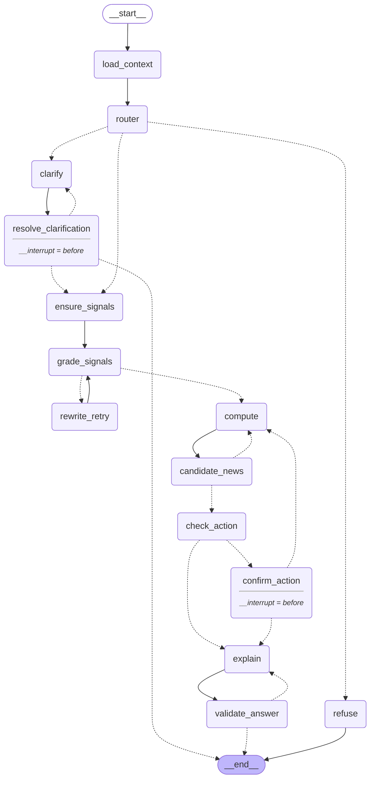

# Агент: LangGraph-граф с ветвлением, ограниченным циклом и human-in-the-loop

Шаг 7 (+ v2). Пакет `src/fplcopilot/agent/`. Принцип проекта без исключений: **LLM маршрутизируют,
извлекают и объясняют; считают детерминированные инструменты** (`core/` — xPts v0, MILP; `rag/` —
сигналы новостей и стратегическая KB). Каждое число в ответе приходит из инструмента уже
округлённым, а ответ объяснителя проверяется кодом против этих чисел; каждое правило игры в
ответе приходит из стратегической базы знаний с цитатой (`docs/strategy_kb.md`).

```bash
uv run python -m fplcopilot.agent.cli --manager 895045 --strategy balanced "Should I sell Palmer?"
uv run python -m fplcopilot.agent.cli --manager 895045 "Стоит ли продавать Palmer?"     # ответ на русском (v2)
uv run python -m fplcopilot.agent.cli --thread <id> --decision confirm|reject   # resume после HITL (хит / Wildcard)
uv run python -m fplcopilot.agent.cli --thread <id> --choose <player_id>        # resume после уточнения имени (v2)
uv run python -m fplcopilot.agent.cli --manager 895045 "Who should I captain?" --json [--prompt-version v1]
uv run python scripts/agent_demo.py --ab docs/agent_prompt_ab.md   # 11 сценариев -> docs/agent_demo_output_v2.md + A/B v1/v2
uv run pytest -q tests/test_agent_*.py         # 70 unit-тестов на фейках (без сети/LLM/БД)
```

Версия промптов — `AGENT_PROMPT_VERSION` (по умолчанию `v4` с 24.09 — чат с историей и новыми
интентами, см. «Чат v4» в конце; `v1`–`v3` хранятся для A/B, см. «Эволюция промптов» ниже и
`docs/agent_prompt_ab.md`).

## Граф

`build_graph(deps).get_graph().draw_mermaid()` (v2: два узла-«человека» — `confirm_action` и
`resolve_clarification`):



| узел | что делает | LLM? | модель / T |
|---|---|---|---|
| `load_context` | bootstrap, текущий/следующий тур, дедлайн, `as_of = now`, состав менеджера (picks последнего тура; 404 -> `squad_summary=None` с объяснением), `diagnose_squad` | нет | — |
| `router` | классификация интента (11 классов: + `player_ranking` — «самый дешёвый но стабильный игрок?», «best value midfielder under 6.0» — рейтинг всей лиги, а не KB), упоминания игроков как написаны, горизонт (v2: `null`, если период не назван явно), **язык вопроса** (`language`, ISO 639-1; v2 — поле роутера, страховка — детектор кириллицы в коде), сценарий (sell/buy/keep/allow_hit/use_wildcard), для `player_ranking` — `ranking` (metric / position / max_price / min_price / limit; код проверяет и достраивает regex-страховкой `ranking_params`, «дешёвый + стабильный» -> `budget_consistency`), `needs_squad`; затем **код** разрешает имена (`agent/resolve.py`) и запоминает, в какой роли (sell/buy/keep) стояло неоднозначное имя | да, structured output (`RouterOutput` / v2 `RouterOutputV2`) | `AGENT_ROUTER_MODEL` (gpt-4o-mini), T = 0 |
| `refuse` | доменный guardrail: `betting` («не даём советов по ставкам; вот что умею»), `off_topic` (одна строка) | нет | — |
| `clarify` | неоднозначное имя -> `pending_clarification = {mention, roles, candidates:[{player_id, name, full_name, team, position, price, ownership, status, in_squad}]}` и текст вопроса на языке пользователя; граф **прерывается** перед `resolve_clarification` | нет | — |
| `resolve_clarification` | узел-«человек» №2: после `resume(thread_id, player_id=…)` добавляет выбранного игрока в `players` и в роли сценария, пишет оговорку «'Gabriel' clarified by you as …» и идёт в `ensure_signals`; осталось ещё неоднозначное имя -> снова `clarify`; `cancel` -> END с текстом уточнения | нет | — |
| `ensure_signals` | для релевантных игроков (упомянутые + проблемные из состава для transfer/plan/lineup/captain, ≤ 8): последний сигнал из `player_signals`, если моложе `AGENT_SIGNAL_MAX_AGE_H` (12 ч), иначе `rag.extract.extract_signal(mode=hybrid_rerank, k=8, save=True)` | внутри `extract_signal` (rag) | `RAG_LLM_MODEL`, T = 0 |
| `grade_signals` | достаточность сигнала: детерминированное правило (статус FPL d/i/s/u/n и сигнал `unknown`/`abstained`/без evidence -> недостаточно) + LLM-грейдер только для спорного случая (есть цитаты, но confidence < 0.4) | опционально | `AGENT_ROUTER_MODEL`, T = 0 |
| `rewrite_retry` | повторное извлечение с альтернативной стратегией: попытка 1 — `dense k=8`, попытка 2 — `hybrid_rerank k=12`; `retries += 1` | внутри `extract_signal` | — |
| `compute` | детерминированная диспетчеризация по интенту (таблица ниже); собирает компактный JSON фактов и **`headline`** — фразу-вердикт, построенную кодом. v2: `strategy_question` -> `answer_strategy_question` (KB) -> `facts.strategy_answer` (ответ с `[n]`, цитаты, готовый блок Sources); для transfer/plan/what_if с хитом или чипом в основной рекомендации (или если хит/WC явно спросили) -> `search_strategy_kb(tags=hits|chips, k=2)` -> `facts.rules_context` | только внутри `answer_strategy_question` (gpt-4o-mini, учитывается как `kb_answer`) | — |
| `candidate_news` | новости по игрокам, которых рекомендует / ранжирует ответ (`news_targets` из `compute`), и дайджесты их клубов; бюджет извлечений на запрос; при недоступной по новости рекомендованной покупке — один пересчёт (`-> compute`); см. раздел «Новости кандидатов» | внутри `extract_signal` / `extract_team_news` | `RAG_LLM_MODEL`, T = 0 |
| `check_action` | если основная рекомендация на текущий тур содержит платный трансфер или Wildcard -> `pending_action` (`action_for()`, та же функция решает про `rules_context`) | нет | — |
| `confirm_action` | узел-«человек»: граф прерывается **перед** ним; после resume читает `user_decision`: `reject` -> `allow_hit=False`, `use_wildcard=False`, назад в `compute` (один раз); `confirm` -> `explain` | нет | — |
| `explain` | markdown-ответ из фактов + цитат **на языке вопроса**: вердикт, таблица опций по явной схеме интента (колонки `Δ next GW` / `Δ horizon` отдельно от xPts), «Why» с цитатами `[source, dd.mm]` (новости) и `[source]` (правило из `rules_context`), «Sources» только по процитированному, «Caveats»; для `strategy_question` — ответ KB с сохранёнными `[n]` и блок Sources verbatim | да, structured output (`answer_markdown`) | `AGENT_EXPLAIN_MODEL` (gpt-4o-mini), T = `AGENT_EXPLAIN_TEMPERATURE` = **0** (до 17.09 — 0.2) |
| `validate_answer` | имена и десятичные числа ответа — только из фактов; заглушки-цитаты запрещены; v2: ссылки `[n]` — только номера цитат `facts.strategy_answer`, маркеры `[n]` обязаны сохраниться в тексте покрытого ответа KB, «-4» в строке вердикта — только если в фактах есть платный трансфер (`hit_mismatch`); провал -> одна регенерация с фидбеком, второй провал -> ответ с видимой оговоркой | нет | — |

**Ветвление** — условные рёбра после `router` (`refuse` / `clarify` / `ensure_signals`), после
`resolve_clarification` (`clarify` / `ensure_signals` / END), после `check_action`
(`confirm_action` / `explain`) и после `confirm_action` (`compute` / `explain`).
**Ограниченный цикл** — `grade_signals -> rewrite_retry -> grade_signals`, не больше
`Deps.max_retries = 2` итераций; каждая пишет в `tool_log` стратегию (`dense k=8`, `hybrid_rerank
k=12`). **Human-in-the-loop** — `interrupt_before=["confirm_action", "resolve_clarification"]` с
checkpointer'ом; решение записывается `update_state(...)` как выход предыдущего узла
(`check_action` / `clarify`), ребро в узел-«человека» от решения не зависит, поэтому граф
продолжает без повторного прерывания. Проверено из двух отдельных процессов CLI (SQLite
`AGENT_CHECKPOINT_PATH`) для обоих видов прерываний.

## Новости кандидатов: узел `candidate_news` (v3, 23.09)

Сигналы новостей раньше брались только ДО расчёта (`ensure_signals`: упомянутые + проблемные игроки
состава), а кандидаты оптимизатора известны только ПОСЛЕ — объяснение «кого взять» шло без новостей
о тех, кого берут. Теперь граф:

```
compute -> candidate_news -+-> check_action -> ...
   ^                       |
   +-----------------------+  (news_reoptimize: рекомендованная покупка недоступна по новости, 1 раз)
```

- `compute` пишет `news_targets` — кого ответ рекомендует / ранжирует: покупки и продажи топ-3
  маршрутов (`AGENT_CANDIDATE_ROUTES`), покупки рекомендованного маршрута помечены `primary`, покупки,
  которые назвал пользователь, — `forced`; ходы ближайшего (и следующего) тура плана (`PlanMoveOut`
  получил `in_id` / `out_id`); primary `what_if`; топ-3 рейтинга; упомянутые игроки для `player_status` /
  `compare_players`. Интенты — `NEWS_INTENTS` (`agent/state.py`).
- `candidate_news`: для каждого кандидата — сигнал из `signals` (уже есть) / сохранённый моложе 12 ч /
  извлечение, пока не исчерпан бюджет `AGENT_NEWS_MAX_LLM_CALLS` (3 на запрос, игроки + клубы, по
  очереди «сигнал кандидата -> дайджест его клуба»); сверх бюджета — `cached_only` (любой возраст,
  оговорка «not refreshed within this request's budget»). Дайджест клуба (`LiveTools.team_news`,
  `docs/rag.md` «Новости в советах») — для покупок / рейтинга / упомянутых, ≤ 3 клубов. xPts модели для
  покупок — `predict_player` (для рейтинга — нет: это прошлые очки, не прогноз).
- В FACTS: `candidate_news.players[<имя>] = {role, team, price, xpts_by_gw, total_xpts_Ngw,
  p_start_model_next_gw, news_signal{availability, start_probability, confidence, signal_as_of,
  signal_age_h, origin, evidence_count, summary}}` и `team_news[<код клуба>] =
  {unavailable_or_doubtful_players (из данных FPL, с return_gw), summary, context_items}`. Цитаты: до 2
  на кандидата в EVIDENCE как обычно; цитаты клуба — в EVIDENCE с `"scope": "club"`, в сигналы игроков
  (`signals`, `candidate_signals`) не попадают никогда. `prune_undiscussed_sources` оставляет строку
  клубного источника, только если ответ называет клуб.
- Повторная оптимизация: если рекомендованная (не навязанная вопросом) покупка по новости `injured /
  suspended / unavailable` (confidence ≥ `AGENT_NEWS_EXCLUDE_MIN_CONFIDENCE` = 0.5, сигнал ≤ 7 дней), для
  `transfer` / `plan` — `news_exclude += [id]`, условное ребро обратно в `compute` (`exclude` в
  `recommend_transfers` / `build_gameweek_plan`; свежие сигналы заодно попадают в xPts через
  `invalidate()`), ровно один раз (`news_reoptimized`). Иначе (второй раз, `what_if`, рейтинг,
  навязанная покупка) — только оговорка. Почему пересчёт, а не только оговорка: оптимизатор
  исключает игроков по статусу FPL, а RAG нужен ровно для случаев, когда пресса опережает FPL; без
  пересчёта ответ рекомендовал бы травмированного с цифрами, посчитанными как для здорового. Цена —
  +1 solve (≈ 1 с) и только в этом редком случае.
- Промпт объяснителя **v3** (`agent/prompts/v3/explain.system.md` = v2 + раздел «NEWS FOR RECOMMENDED
  AND RANKED PLAYERS»; сообщение получает блок **NEWS** с готовыми цитатами — как RULES CONTEXT, потому что
  внутри FACTS JSON модель новости игнорировала). `max_tokens` для v3 — 2000 (русский ответ с таблицей и
  новостями упирался в 1400). Роутер **v3** = v2 + правило: разбор своего состава («посмотри мой состав,
  скажи слабые места», «weak spots») -> `transfer` (в v2 такие вопросы уходили в `off_topic`; отдельного
  интента нет — слабые места = `squad_issues` + маршруты, которые их чинят, объяснитель v3 начинает с
  них). Файлы, которых нет в v3, берутся цепочкой v3 -> v2 -> v1 (`load_agent_prompt`); v1 / v2
  рендерятся как раньше (A/B-воспроизводимость). Включение: `AGENT_PROMPT_VERSION=v3` / CLI
  `--prompt-version v3`.
- `Deps.candidate_news=False` (или `AGENT_CANDIDATE_NEWS=false`) выключает узел; инструменты без метода
  `team_news` (фейки) работают без клубного контекста. Тесты — `tests/test_candidate_news.py`.

## Инструменты (`agent/tools.py`) — ровно то, что выставляет MCP-сервер

Pydantic-схемы входа/выхода; протокол `AgentTools` подменяется фейком в тестах. Каждый вызов из
графа проходит через `call_tool` и попадает в `tool_log` с латентностью и ошибкой (ошибка
инструмента не валит граф — становится оговоркой в ответе).

| инструмент | что внутри (core/rag) | интенты |
|---|---|---|
| `get_gameweek_context` | bootstrap, `load_inputs` (состав, банк, FT, чипы, xPts горизонта, `diagnose_squad`), picks с ролями (C/VC/скамейка); 404 -> `SquadUnavailable` с текстом («team starts in GW5, picks visible after the deadline») | все |
| `diagnose_squad` | `candidates.diagnose_squad` -> issues, проблемные игроки | все с составом |
| `predict_player` | `PredictionStore.get(gw)[pid]` на горизонт: xPts, sd, p_start, минуты, компоненты, фикстуры (соперник, дом/выезд, FSI, xG), сигнал в модели минут | упомянутые игроки |
| `compare_players` | `predict_player` × N + ранжирование по сумме xPts | compare_players |
| `analyze_player_risk` | последний сигнал из `player_signals` (с evidence jsonb) или `extract_signal(...)`; origin `cached` / `extracted` / `unavailable`, токены и латентность | ensure_signals / rewrite_retry |
| `optimize_team` | `best_xi` + top-3 капитанов с тегом по владению: > 30 % safe, 10–30 balanced, < 10 differential; текущий капитан и очки текущих 11 | captain, lineup |
| `recommend_transfers` | `single_transfer` (top-3, вердикты по хиту) либо, если вопрос требует продать/купить конкретного игрока, `constrained_routes` — та же MILP (`ModelSpec`/`Model`) с ограничениями `t_in[p] = 1` / `t_out[p] = 1` и no-good cuts; плюс лучший маршрут без ограничения для сравнения и детерминированный `verdict_on_forced_sale` | transfer |
| `build_gameweek_plan` | `plan_transfers` (горизонт 5, WC-альтернатива), `latest_plan` -> `diff_plans`, `save_plan` | plan |
| `simulate_scenario` | `constrained_routes` с force_in/force_out/keep/exclude/allow_hit; если просили хит, а оптимум без него — считается и «версия с хитом» (`Σ t_in ≥ FT + 1`) для честного сравнения; `use_wildcard` -> `plan_transfers` с WC | what_if |
| `search_strategy_kb` (v2, 10-й инструмент MCP) | `rag.kb.retrieve.KBRetriever.search(query, tags, k, mode)` -> `{chunks: [{chunk_id, doc_id, title, url, source, tags, text, score}]}`; reranker общий с новостным Retriever (одна ONNX-сессия) | `rules_context` для transfer/plan/what_if с хитом/чипом |
| `answer_strategy_question` (v2, обёртка агента, в MCP не выставлена) | `rag.kb.answer.answer_strategy_question(query, k=6)` -> ответ с `[n]`, проверенные цитаты `{n, title, url, source, tags, quote}`, `covered`, учёт единственного LLM-вызова (токены, `cost_usd`) | strategy_question |
| `rank_players` (11-й инструмент MCP) | детерминированный рейтинг всей лиги: bootstrap (`total_points`, `now_cost`, `minutes`, `form`, ppg) + `player_gw_history` по раундам < gw (доля сыгранных туров с ≥ 5 / ≥ 2 очков, пропущенные матчи, std очков, очки по турам); метрики `points_per_million` / `total_points` / `consistency` / `budget_consistency` (стабильность, затем цена) / `form`; фильтры позиции, цены, минут (по умолчанию 45 × начавшихся туров), статусов i/s/u/n; `in_squad` по составу; **окно туров** `gw_from` / `gw_to` / `last_n_gws` («кто был лучшим в gw4 и gw5», «last 3 gameweeks» — от последнего завершённого тура; роутер v2 + regex-страховка) — очки, минуты, pts/£m и стабильность только по истории за окно, порог минут 45 × туров окна, `window_label` («GW4–GW5» / «season to date») в headline и facts; нет истории или она не покрывает окно -> `HistoryUnavailable` (оговорка, а не тихий откат к сезону); без LLM, ~50 мс. Объяснитель обязан вывести все строки в порядке инструмента, не пере-ранжировать (`facts.player_ranking.order`) и брать окно/фильтры дословно (`filters_definition`: «не менее N минут») | player_ranking |

Кэш `LiveTools` живёт в рамках процесса (входы оптимизатора по ключу manager/gw/horizon/strategy);
после нового извлечения сигнала граф вызывает `invalidate()`, чтобы свежий сигнал попал в модель
минут и в xPts.

## Стратегическая KB в графе (v2)

Две точки входа, обе через `compute` (см. `docs/strategy_kb.md` про саму базу):

1. **Интент `strategy_question`** («Когда лучше сыграть Wildcard?», «How do free transfers
   accumulate?») -> `answer_strategy_question(query, k=6)`: KB-конвейер (hybrid_rerank -> gpt-4o-mini
   -> детерминированная проверка `[n]` и verbatim-цитат) -> `facts.strategy_answer = {answer,
   covered, citations[{n, title, url, source, tags, official_rules, quote}], sources_markdown}`.
   Из фактов для этого интента убирается блок менеджера — вопрос общий, состав не нужен.
   `headline`: «Strategy KB answer with N cited source(s) (K official rules): …» либо «Not covered».
   Объяснитель обязан сохранить каждый маркер `[n]` у своего утверждения и скопировать блок
   Sources verbatim; переводить он может только прозу. Это проверяет валидатор: неизвестный `[n]`
   -> регенерация, пропавшие маркеры (модель заменила `[3]` на `[fplpilot]` — так было в первом
   живом прогоне) -> регенерация. Стоимость: +1 LLM-вызов (`kb_answer`, ≈ $0.0004–0.0006, 3–4 с).
2. **`rules_context` для решений о хите / чипе** (transfer / plan / what_if): если
   `action_for()` видит хит или Wildcard в основной рекомендации — либо пользователь явно спросил
   про хит / WC (`scenario.allow_hit` / `use_wildcard`, `hit_alternative_as_asked`,
   `wildcard_alternative` плана) — `compute` строит запрос **из ситуации, а не из текста
   пользователя** («when is a -4 points hit worth it [for two transfers]», «when to play the
   wildcard with many injured players in the squad» при ≥ 3 серьёзных проблемах) и берёт
   `search_strategy_kb(tags=["hits"] | ["chips"], k=2)`. В факты попадает
   `rules_context = {about, kb_query, excerpts[{source, title, url, tags, official_rules, text ≤ 420
   символов}]}`. Промпт v2 просит **одну** цитату правила `[source]` там, где обосновывается хит /
   чип; это совет, числа по-прежнему из оптимизатора. `Deps.rules_context=False` выключает.

Пример из демо v2 (what_if, ветка `confirm`): «… every extra transfer beyond the free ones
costs 4 points [premierleague]» + строка `premierleague — FPL Rules Copilot,
https://www.premierleague.com/en/news/4661029` в Sources (полный текст — `docs/agent_demo_output_v2.md`).

## Разрешение имён (`agent/resolve.py`, без LLM)

1. `EntityMatcher` (тот же, что тегирует новости) по тексту запроса — уверенные id (полные имена,
   инициалы, контекст клуба). 2. Каждое упоминание роутера — по токенам без диакритики как
   подпоследовательность web_name / полного имени («Saka» ≠ Wan-Bissaka). 3. Несколько кандидатов:
   (a) одно слово, которое у ≥ 2 кандидатов — имя («Gabriel»: Magalhães, Martinelli, Jesus,
   Gudmundsson; «Pedro») -> **неоднозначно -> `clarify`**, даже если у кого-то это web_name;
   (b) совпадение фамилий («Palmer»: Cole / Alex) -> ровно один в составе менеджера -> он, с
   пометкой в оговорках; (c) иначе доминирование по владению (лидер ≥ 5× второго и ≥ 5 %) -> он с
   пометкой «say the full name for …»; иначе `clarify`. 4. Не найден -> оговорка в ответе.

## Факты для объяснителя и защита от выдумок

`compute` собирает компактный JSON: контекст тура, менеджер (состав, банк, FT, чипы, issues),
игроки (xPts по турам, p_start, компоненты, фикстуры с FSI, статус FPL и новостной сигнал),
результат инструмента интента и **`headline`** — вердикт, собранный кодом из чисел («Scenario
feasible, NO hit needed — free transfers cover it: Gabriel, Rogers -> Saka, Guéhi (2 transfers,
no hit): +2.96 xPts next GW, +7.13 over the horizon; verdict go»). Промпт обязывает вердикт
повторять `headline`; это главный барьер против «−4», которого нет в фактах, и против переворота
вердикта оптимизатора. Цитаты передаются отдельным списком `{player, source, date dd.mm, url,
quote}`.

**Валидатор** (`agent/validate.py`): слово с заглавной буквы (≥ 3 букв, не ALL-CAPS, без цифр)
должно быть среди токенов фактов/цитат/имён игроков и клубов или быть обычным английским словом
(частотный словарь `rag/entity_matcher.common_english_words` + стоп-лист слов форматирования);
десятичное число должно совпадать с числом фактов с точностью до показанного округления (6.2 ≈
6.20, но 6.31 ≠ 6.2); даты `dd.mm` цитат разрешены; заглушки `[FACTS]`, `[source, dd.mm]` —
нарушение. Целые числа не проверяются (GW, %, ранги). В демо валидатор поймал две выдуманные
суммы (58.94 = 56.14 + 2.8; 61.60/59.14) — первая исправлена регенерацией, вторая осталась с
видимой оговоркой; после этого `xi_points_after` добавлен в факты, и такое число стало проверяемым.

## HITL: два вида прерываний

**Действие (хит / Wildcard), `interrupt_kind = "action"`.**

1. `check_action` видит хит или Wildcard в основной рекомендации -> `pending_action = {kind,
   detail, cost}`; условное ребро ведёт в `confirm_action`, перед которым граф прерывается;
   `Agent.run` возвращает состояние с `interrupted=True`, CLI печатает команду resume.
2. `Agent.resume(thread_id, "confirm" | "reject")` -> `update_state({"user_decision": ...},
   as_node="check_action")` -> `invoke(None)`: узел `confirm_action` записывает решение,
   `reject` меняет сценарий (`allow_hit=False`, `use_wildcard=False`) и возвращает в `compute`
   (ровно один пересчёт: на втором проходе `check_action` уже не ставит `pending_action`);
   `confirm` идёт в `explain` с оговоркой «you confirmed the hit».

**Уточнение имени, `interrupt_kind = "clarification"` (v2; в v1 `clarify` была терминальной
ветвью и пользователь переспрашивал заново).**

1. Резолвер (`agent/resolve.py`, без LLM) не может выбрать игрока («Gabriel»: Magalhães,
   Martinelli, Jesus, Gudmundsson) -> `router` пишет `clarification.mentions[{mention, candidates,
   roles}]` (`roles` — в какой роли сценария стояло имя: sell / buy / keep) -> `clarify` кладёт
   первое имя в `pending_clarification = {mention, roles, candidates:[{player_id, name, full_name,
   team, position, price, ownership, status, in_squad}]}` и текст вопроса (на языке пользователя,
   «в вашем составе» у кандидата из состава); граф прерывается перед `resolve_clarification`.
2. `Agent.resume(thread_id, player_id=4)` (или `decision="cancel"`) проверяет, что id — один из
   кандидатов (иначе `ValueError` с их списком, состояние не меняется), пишет
   `update_state({"clarification_choice": {...}}, as_node="clarify")` и продолжает:
   `resolve_clarification` добавляет игрока в `players` и в роли сценария (`scenario.sell == [4]`),
   пишет оговорку «'Gabriel' clarified by you as Gabriel dos Santos Magalhães (ARS)» и идёт в
   `ensure_signals` -> обычный путь до `explain`. Несколько неоднозначных имён уточняются по
   одному (`resolve_clarification -> clarify -> interrupt` снова). `cancel` завершает тред текстом
   уточнения без вызова инструментов состава.
3. CLI: `--thread <id> --choose <player_id>` / `--decision cancel`; чат (`app/views/5_chat.py`):
   кнопка на каждого кандидата (+ «Отменить уточнение») -> `stream_resume(thread_id,
   player_id=...)`, как кнопки confirm/reject для действия.

Чекпоинты — `langgraph-checkpoint-sqlite` в `.cache/agent_checkpoints.sqlite`, поэтому
прерывание и resume — два разных запуска CLI для обоих видов (проверено: тред `clar-live-1` —
`Should I sell Gabriel?` -> `--choose 4` из второго процесса -> полный ответ по трансферу). В
демо v2: what_if -> reject / confirm на двух тредах, clarification -> `--choose 4` на том же треде
(`docs/agent_demo_output_v2.md`).

## Промпты, стриминг, трейсинг

- Промпты агента — файлы `agent/prompts/<version>/`; активная версия `AGENT_PROMPT_VERSION`
  (по умолчанию `v4` с 24.09, `config.py`; до этого `v2`). Каждая версия переопределяет только
  изменённые файлы (`v2/` — `router.system.md` и `explain.system.md`, `v3/` и `v4/` — свои роутер и
  объяснитель), остальное берётся цепочкой вниз: `grader.system.md` и `rules_digest.md` (запасная
  выжимка правил на случай недоступной KB) — из `v1/` (`load_agent_prompt` с fallback). Версия — в `llm_calls[*].prompt_version`
  (`kb:v1` у вызова внутри `answer_strategy_question`). `Deps.prompt_version` / `live_agent(
  prompt_version=...)` / CLI `--prompt-version` переключают версию без правки `.env`.
- `Agent.stream(...)` / `stream_resume(...)` отдают `(узел, строка статуса)` по `stream_mode=
  "updates"` — то, что печатает CLI в stderr и что показывает UI; строка `__interrupt__`
  различает ожидание решения и ожидание выбора игрока; `snapshot(thread_id)` — итог
  (+ `interrupted`, `next_nodes`, `interrupt_kind`).
- Трейсинг: `agent/tracing.py` при импорте пакета переносит `LANGSMITH_*` из настроек в окружение
  (+ `LANGCHAIN_TRACING_V2` / `LANGCHAIN_API_KEY` / `LANGCHAIN_PROJECT`); без ключа — принудительно
  выключено и без предупреждений. Вызовы OpenAI уже идут через `wrap_openai` (rag/llm.py); граф
  трейсится callbacks langchain-core с тегами `strategy:*`, `model:*`, `intent:*` (интент
  добавляется к корневому run после `router`). До 23.09 ключ в `.env` был пуст; с 23.09 он задан,
  но месячная квота трейсов проекта исчерпана (LangSmith отвечает 429) — процесс после отказов сам
  выключает трейсинг (`tracing._LangSmithFailureGuard`, см. «Чат v4» ниже), сайдбар UI показывает
  причину. Включается непустым `LANGSMITH_API_KEY`, без правок кода.

## Стоимость и латентность (демо v2 17.09, gpt-4o-mini, manager 895045)

| сценарий | LLM-вызовы | токены | $ | wall |
|---|---|---|---|---|
| status «Is João Pedro fit for GW5?» | 2 (route, explain) | 6.3k | 0.0012 | 6 с |
| transfer «Should I sell Palmer?» / «Стоит ли продавать Palmer?» | 2 (+ извлечение сигнала при первом запросе) | 7.7k | 0.0015 | 7–8 с |
| captain | 2 | 6.6k | 0.0012 | 5 с |
| plan (5 туров, WC-сравнение) | 2 | 6.6k | 0.0013 | 11 с (5 с — солвер) |
| what_if до прерывания (+ `search_strategy_kb` для rules_context) | 1 (route) | 2.2k | 0.0004 | 4 с |
| resume reject / confirm | +1 explain (+1 при регенерации) | 7–8k | 0.0013–0.0015 | 4–8 с |
| clarification: прерывание -> `--choose 4` -> полный ответ | 1 + 1 | 2.2k + 7.5k | 0.0004 + 0.0015 | 1 с + 7 с |
| strategy_question «Когда лучше сыграть Wildcard?» | 3 (route, **kb_answer**, explain) | 7.9k | 0.0014 | 8 с (KB 3–4 с) |
| transfer с вопросом о хите (rules_context) | 2 | 7.3k | 0.0014 | 8 с |
| betting / off_topic | 1 (route) | 2.2k | 0.0003–0.0004 | 1 с |

Весь демо-прогон v2 (14 запусков) — **≈ $0.0145** (v1: 10 запусков, $0.0068–0.0075; рост — за счёт
трёх новых сценариев, более длинного системного промпта v2 (+0.7k токенов на вызов) и блоков
RULES CONTEXT / KB ANSWER); типичный запрос — 0.0012–0.0015 $. Роутер 1–2 с, объяснение 3–5 с,
извлечение сигнала 3–4 с, `search_strategy_kb` 0.7–1.6 с тёплый, MILP 0.4–1.3 с (план 5 туров —
5 с). Мини-A/B промптов (7 сценариев × 2 версии) — ещё ≈ $0.013; весь шаг v2 уложился в ≈ $0.07
из бюджета $0.30 (три полных прогона демо + A/B + живые проверки).

## Тесты

`tests/test_agent_graph.py` (17): ветвление (betting -> refuse без explain; off_topic; неоднозначное
имя -> clarify + прерывание с `pending_clarification`), счастливый путь transfer с проверкой
аргументов инструмента, ответ без состава, ограниченный цикл (ровно 2 повтора, стратегии `dense
k=8` -> `hybrid_rerank k=12`, LLM-грейдер для спорного сигнала, достаточный сигнал без повторов),
HITL (прерывание перед `confirm_action`, resume reject -> `recommend_transfers(allow_hit=False)`,
resume confirm без пересчёта, ошибки resume, wildcard-сценарий), валидатор (выдуманное число ->
одна регенерация с фидбеком; чужое имя -> оговорка после второго провала), структура графа
(mermaid: цикл, два interrupt, `clarify --> resolve_clarification`), стриминг (`lang=` в статусе).
`tests/test_agent_v2.py` (30, v2–v4): `strategy_question` зовёт `answer_strategy_question`, факты
несут цитаты и `sources_markdown`, `[1]`/`[2]` объяснителя проходят валидатор, LLM-вызов KB учтён
как `kb_answer`; «not covered» -> честная оговорка; отказ KB -> запасной `rules_digest`; неизвестный
`[7]` -> одна регенерация; хит в рекомендации -> `search_strategy_kb(tags=["hits"], k=2)` ->
`rules_context` (premierleague официальный, fplwatch гайд) и `[premierleague]` проходит валидатор
после confirm; Wildcard-сценарий -> теги `chips`; бесплатный трансфер без вопроса о хите -> KB не
трогаем; `Deps.rules_context=False`; чистые функции `rules_context_kind` / `rules_context_query`;
уточнение имени: `stream` заканчивается `clarify -> __interrupt__`, `resume(player_id=4)` продолжает
с Gabriel Magalhães (`scenario.sell == [4]`, `recommend_transfers(sell=[4])`, оговорка), чужой id
-> `ValueError` без изменения состояния, `confirm` на уточнении -> `ValueError`, `cancel`; два
неоднозначных имени уточняются по одному; русский текст уточнения и строки статуса; язык: кириллица
-> `ru` без поля роутера, поле `language` роутера v2 главнее эвристики, русские подсказки горизонта
(«на 5 туров»); промпты: `available_prompt_versions() == ["v1", "v2", "v3", "v4"]`, v2 переопределяет только
router/explain (grader / rules_digest — из v1), `RouterOutputV2` vs `RouterOutput`, сообщение
объяснителя v1 без LANGUAGE/блоков, v2 — с блоками RULES CONTEXT / KB ANSWER при тех же FACTS.
`tests/test_agent_resolve.py` (7), `tests/test_agent_validate.py` (11: + `[n]` только из
`facts.strategy_answer.citations`, пропавшие маркеры, `[source]` для `rules_context`, заглушки,
`strip_bad_citations` с неизвестными ссылками, «-4» в вердикте без платного трансфера
(`hit_mismatch`; не срабатывает при хите в маршрутах / плане / решении пользователя и на «-4.1»),
`prune_undiscussed_sources` — строки Sources о необсуждаемых игроках уходят, правила / KB /
неизвестные URL остаются, пустой раздел исчезает), `tests/test_agent_tools.py` (5 —
`constrained_routes` на игрушечном пуле). Всё без сети/LLM/БД через `Deps`; чат с кнопками
уточнения — `tests/test_app_smoke.py` (AppTest: кнопки-кандидаты -> клик -> `recommend_transfers(
sell=[4])`, кнопка «Отменить»). Итого по проекту на 24.09: 812 тестов `-m "not network"` (+10 сетевых;
было 454 на 17.09).

## Известные ограничения

- Состав = picks последнего завершённого тура; трансферы текущего тура и цены продажи публичный
  API не отдаёт (docs/optimizer.md). Команда владельца (10835228) без публичных picks до дедлайна
  GW5 — агент объясняет это и отвечает на уровне игроков (или по скриншоту, docs/vision.md).
- `plan` после `reject` пересчитывается без Wildcard и без платных трансферов во всём горизонте:
  `confirm_action` ставит `scenario.allow_hit = False`, а `compute` передаёт в `build_gameweek_plan`
  `allow_hits=False` (флаг `plan_transfers`, `a423074`). Если сценарий без хита невыполним
  (пользователь сам навязал продажи сверх FT), ответ показывает его как есть с оговоркой.
- Горизонт от роутера принимается только при явном упоминании периода в вопросе (регулярка
  `HORIZON_HINT`, в v2 — и русские формы «на 5 туров»): роутер v1 писал `1` вместо `null`, v2
  обязан отдавать `null`, регулярка остаётся страховкой.
- Числовая проверка не видит целых чисел и логических ошибок (например, «−4» без хита) — их
  закрывает `headline`; ALL-CAPS токены и слова из частотного словаря не проверяются как имена;
  кириллические слова именами не считаются вовсе (в русском ответе проверяются только латинские
  имена и числа) — числа при этом обязаны быть с точкой (промпт), иначе «4,76» проверку обходит.
- `rules_context` — совет, а не проверка: валидатор проверяет форму цитаты `[source]`, но не то,
  что правило действительно подтверждает вердикт; корпус тега `hits` мал (2 документа /
  43 чанка), поэтому чаще всего цитируются официальная страница правил и внутренний дайджест.
- Стратегический ответ ограничен качеством KB (`docs/strategy_kb.md` §7): один снимок 17.09,
  только английские источники (русский вопрос идёт в эмбеддинги как есть — на демо hit@6
  сработал, метрик нет), мнения ≠ правила.
- Уточнение имени показывает до 6 кандидатов; выбор «никто из них» = `cancel` и новый вопрос.
- Стоимость — оценка по прайсу gpt-4o-mini; эмбеддинги запроса поиска не учитываются (< $0.0001).

## Эволюция промптов v1 -> v2 (`agent/prompts/v2/`, A/B — `docs/agent_prompt_ab.md`)

Слабости v1 были записаны после первого демо (`docs/agent_demo_output.md`) — ниже они же и что
сделано с каждой. Общее правило осталось: только числа и имена из FACTS, вердикт = `headline`.

| # | сбой v1 (где виден) | изменение в v2 |
|---|---|---|
| 1 | «Sources» перечисляли цитаты игроков, которых ответ не обсуждает (сигналы проблемных игроков состава; captain / plan в демо v1 — три ссылки про João Pedro при вопросе о капитане) | `explain`: Sources строится **механически** из процитированного в Why (число строк ≤ число цитат), EVIDENCE об игроках, которых ответ не обсуждает, не перечисляется; метрика «Sources только по обсуждаемым» в A/B. В трёх прогонах A/B (T = 0.2) промпт v2 один раз правило всё же нарушил (7a после уточнения имени — три строки про João Pedro; v1 — тоже один раз), поэтому `validate_answer` дополнительно **детерминированно вырезает** такие строки (`prune_undiscussed_sources`, в `validation.pruned_sources`) — правила и цитаты KB не трогаются |
| 2 | Модель складывала числа (58.94 = 56.14 + 2.8; 61.60/59.14 — пойманы валидатором в демо v1) и ставила Δ в колонку xPts / голую «Δ» | `explain`: **явная схема таблицы по интенту** — маршруты: `Route \| XI xPts after (next GW) \| Δ next GW \| Δ horizon (H GW) \| Hit \| Risk`; капитан: `Player \| xPts \| Captain points (×2) \| Ownership % \| Tag \| Fixture`; план; статус — Δ подписана и отделена от xPts; «никаких сумм» повторено в правилах языка (копировать цифры посимвольно) |
| 3 | `router`: `horizon=1` вместо `null` при неназванном периоде, изредка transfer ↔ what_if | `router`: «`horizon` — только явно названный период, иначе null, не выводить из интента» + примеры («Should I sell Palmer?» -> null; «Is João Pedro fit for GW5?» -> null — номер тура не период); разграничение transfer / what_if / strategy_question примерами («Is a -4 worth it this week?» -> transfer; «When is a -4 worth it?» -> strategy_question; «Should I wildcard now?» -> plan) |
| 4 | Ответ всегда на английском; язык вопроса никак не учитывался | `router` v2 отдаёт `language` (ISO 639-1; `RouterOutputV2`), код страхует детектором кириллицы; `explain` пишет прозу и заголовки разделов на языке вопроса, имена/клубы/теги/коды вердикта — как в FACTS, числа — посимвольно с точкой; в сообщение объяснителя добавлена строка `LANGUAGE` |
| 5 | Заглушки `[FACTS]`, `[source, dd.mm]` (валидатор ловил, но это стоило регенерации) | `explain`: правило «в квадратных скобках — только `[source, dd.mm]` новостей, `[source]` правила из RULES CONTEXT, `[n]` ответа KB; никаких `[FACTS]`/литералов»; фидбек валидатора различает заглушки, неизвестные `[n]` и пропавшие маркеры |
| 6 | Решения о хите / чипе объяснялись только числами оптимизатора, без правила игры; `strategy_question` отвечал по встроенной выжимке без цитат | `compute` подшивает `rules_context` (KB, теги hits / chips) и `strategy_answer` (KB с `[n]`); `explain` получает отдельные блоки **RULES CONTEXT** (с готовой строкой цитаты `[premierleague]`) и **KB ANSWER** (маркеры + SOURCES BLOCK verbatim); валидатор проверяет `[n]` и сохранность маркеров |
| 7 | `clarify` — терминальная ветка, пользователь переспрашивал с полным именем | не промпт, а граф: `clarify -> resolve_clarification` с прерыванием и `resume(player_id=…)`; текст уточнения на языке вопроса |

Не изменилось: `grader.system.md` (в демо все сигналы проходят детерминированное правило, LLM-грейдер
не вызывался — калибровать нечем), `rules_digest.md` (остался только как запасной вариант при
недоступной KB). Сообщение объяснителя v1 рендерится ровно как в шаге 7 (без строки LANGUAGE и
блоков), поэтому A/B сравнивает версии «как есть» на одинаковых FACTS / EVIDENCE / CAVEATS.

**Мини-A/B** (`scripts/agent_demo.py --ab`, 7 сценариев демо с ответом объяснителя × 2 версии,
факты посчитаны один раз графом v2; полный отчёт — `docs/agent_prompt_ab.md`, финальный прогон
17.09 13:10Z):

| метрика | v1 | v2 |
|---|---|---|
| нарушений валидатора до регенерации / регенераций | 0 / 0 (в двух из трёх прогонов дня — 1: выдуманное `2.67`) | 0 / 0 (во всех трёх) |
| ответов с заглушками `[FACTS]`, `[source, dd.mm]` | 0 | 0 |
| Sources только по обсуждаемым игрокам | 6/7 (3 строки про João Pedro в 7a) | 7/7 (в одном из трёх прогонов — 6/7) |
| таблиц с подписанной колонкой Δ | 0/3 | 5/5 |
| ответов с цитатой правила `[source]` при хите (применимо: 5b) | 0 | 1 |
| токенов ответа (в среднем) / стоимость 7 ответов | 457 / $0.0054 | 510 / $0.0068 |

**Решение: ships v2** (`AGENT_PROMPT_VERSION=v2`) — не хуже по нарушениям, подписанные Δ,
цитата правила, язык ответа, без заглушек; цена — +$0.0002 на ответ. Гигиену Sources промпт
гарантирует ненадёжно у обеих версий — её закрывает код (`prune_undiscussed_sources`).

**Дефолты после сверки 17.09 (defaults).** Температура объяснителя переведена с 0.2 на **0**
(`AGENT_EXPLAIN_TEMPERATURE`, `config.py`; `explain_llm(temperature=None)` берёт её из настроек) по
`docs/LLM_CHOICE.md` §4.2: на одинаковых фактах валидатор проходит с первого раза 0.92 против 0.79
при 0.2, длина / judge / цена / латентность не меняются, а каждая избегнутая регенерация экономит
3–4 с и $0.0007. Демо v1/v2 и мини-A/B выше сняты ещё на 0.2 (это зафиксировано в их шапках);
контрольный прогон трёх сценариев на T = 0 (transfer «Should I sell Palmer?», captain, russian
strategy_question) — валидация пройдена с первой попытки во всех трёх (39/18, 22/18, 18/0 имён/чисел
проверено), тот же вердикт, что в демо. Остальные дефолты без изменений: роутер / грейдер / KB /
vision T = 0, `max_tokens` 400 / 120 / 1400.

Что показали живые прогоны v2 до финального демо (и что закрыто): (а) на русский стратегический
вопрос объяснитель заменял маркеры `[3]` на `[fplpilot]` — добавлена проверка «маркеры пропали» в
валидатор (регенерация) и блок KB ANSWER с прямым указанием; (б) при английском вопросе после
уточнения имени заголовки разделов вышли на русском (пример перевода в промпте был прочитан как
инструкция) — строка LANGUAGE теперь явно говорит «keep the English section titles»; (в) правило
из `rules_context` не цитировалось, пока лежало только внутри FACTS JSON, — вынесено в отдельный
блок RULES CONTEXT с готовой строкой цитаты (после этого: «…costs -4 points in that gameweek
[premierleague]»); (г) на «Should I take a -4 this week to fix my squad?» объяснитель написал
«You should take a -4…», хотя все маршруты бесплатные (таблица и bullets говорили «без хита») —
перевёрнутый вердикт, который числовая проверка не видит (4 — целое). Закрыто с двух сторон:
`headline` для transfer при `allow_hit` и бесплатном лучшем маршруте теперь явно говорит «NO hit
needed … a paid transfer (-4) is NOT recommended», а валидатор получил правило `hit_mismatch`
(«-4» в строке вердикта без платного трансфера в фактах -> регенерация с фидбеком).

## Чат v4 (24.09): история диалога, новые интенты, фишки в плане

Диагностика — `docs/chat_diagnosis.md`, A/B v3 → v4 — `docs/EVALS.md` §9, эволюция промптов —
`docs/agent_prompt_ab.md`. Поведение v4 включается версией промптов (`graph.chat_v4`: `v4+`), v1–v3
идут по старым веткам графа.

**История.** Страница чата передаёт `Agent.stream(..., history=[...])` — последние 6 реплик
(`agent/chat.history_from_messages`): текст пользователя; ответ ассистента + `meta` его хода
(`chat.turn_meta`: интент, игроки, тур, целевой тур, фишки, keep / sell / buy, allow_hit, headline).
`chat.render_history` уходит в `RouterRequest.history` и `ExplainRequest.history`. Роутер v4
переписывает уточнение в самостоятельный вопрос (`standalone_query`, «а на gw7?» -> «Кого взять
вместо Wissa в GW7?»), наследуя только то, что просил пользователь, не советы ассистента; имена,
горизонт и фильтры ищутся в переписанном вопросе. HITL не менялся: каждый ход — свой тред.

**Новые интенты** (`state.INTENTS`, `llm.RouterOutputV4`), числа — только из инструментов:

| интент | инструменты | факты |
|---|---|---|
| `squad_review` | `optimize_team` + `recommend_transfers` + проблемы `diagnose_squad` | `squad_review`: issues, xPts лучшего XI vs текущего, лучший фикс; без «оценки N/10» |
| `fixtures` | `team_fixtures` (FSI из прогнозов xPts) | `fixtures`: клубы из вопроса + 5 лёгких / 3 тяжёлых календаря |
| `chips` | `chips_status` (окна bootstrap + история менеджера), при «фишка в GW N» — `build_gameweek_plan(chips=…)` | `chips_status`, `chip_plan` |
| `general_fpl` | контекст тура, `transfer_trends`, `chips_status`, KB | `gameweek`, `transfer_trends`, `what_i_can_compute` — частичный ответ вместо отказа |

Незнакомый интент в v4 -> `general_fpl`, `off_topic` — только настоящий off-topic и инъекции.
Прогноз очков / соперники одного игрока — `player_status`. Рейтинг «кто БУДЕТ лучшим» —
`rank_forecast` (сумма xPts модели на горизонт или xPts/£m, `max_ownership` для дифференциалов),
«кто был» — прежний `rank_players` по истории.

**Фишки, тур, ограничения.** Роутер отдаёт `chips=[{chip, gw}]`, `target_gw`, `allow_hit`, `keep`.
- plan: `BuildPlanInput(chips=…, allow_hits=allow_hit is not False, keep=…)`, горизонт до
  целевого тура / тура фишки («BB в GW7» при GW6 -> план GW6–GW7);
- `ChipPlanError` -> `facts.chip_plan.feasible=false` с причиной (объяснитель начинает с неё) и
  план без фишки;
- lineup с фишкой -> plan; lineup / captain на будущий тур -> `optimize_team(gw=target)` (входы
  ближайшего тура с горизонтом до целевого);
- keep игрока не из состава отбрасывается с оговоркой;
- для итогового состава плана — xPts каждого игрока на целевой тур
  (`plan.xpts_of_squad_at_end_of_plan`).

Проверено живьём:
- 6856911: BB в GW7 без хитов с João Pedro — план, скамейка BB (+6.27 xPts);
- 895045: «Bench Boost недоступен: уже сыгран» и план без фишки.

**Служебные тексты на языке вопроса** (`agent/chat.py`):
- отказ `off_topic` / `betting`;
- фолбэк при сбое объяснителя — вердикт кода без JSON;
- оговорка валидатора после неудачной регенерации вместо английского `⚠ Validation`; детали — в
  футере «Как получен ответ», там же версия промптов и вопрос с учётом истории;
- подсказка `--choose` убрана из уточнения имени (её печатает CLI).

**Валидатор** (`agent/validate.py`), новые проверки:
- номера туров (`unknown_gws`) и «тур из вопроса, выданный за посчитанный» (`gw_uncovered`); «3
  тура» — период, не GW3;
- выдуманная оценка «N из 10» (после исчерпания регенераций фраза вырезается);
- капитан в ответе ≠ капитан модели (`captain_mismatch`, без части про вице);
- «на скамейку X», где X в стартовом XI модели (`bench_mismatch`);
- опечатка имени в одну букву («Caka» -> Saka) исправляется детерминированно;
- число чужого игрока (`misattributed_numbers`, 24.09): в строке таблицы / пункте списка /
  предложении ровно один игрок и число метрики (xPts, £, %, очки; в таблице — столбец с таким
  заголовком), которое в фактах есть только у других игроков. Консервативно: строки с двумя+
  игроками, с неизвестным именем с заглавной или с кириллическим именем не проверяются; суммы
  плана, банк, маршруты трансферов, совпадение числа у двух игроков — не нарушение. Офлайн по
  223 сохранённым ответам (v4: прогоны 2–4, holdout, смоуки; v3 A/B) — 10 срабатываний, все
  истинные и все в одном ответе (v4-run2 c20: xPts João Pedro и Van Hecke в строках Haaland, Palmer,
  Hall…; старые проверки его пропустили), ложных 0; в прогоне 4 проверено 182 числа — 0.

Проверка кириллических имён (`cyrillic_names`, `translit.py`) не менялась.

**Устойчивость.** Повтор OpenAI-вызова при 429 / обрыве (`llm._parse`, 2 повтора); при
`LengthFinishReasonError` объяснитель v4 повторяет ответ один раз с требованием краткости.

**Метрики** (60 вопросов, `evals/golden/chat.jsonl`; baseline -> v4, прогон 4 на финальном коде):
- интент: 45/60 -> 58/60;
- ложные отказы: 10/55 -> 0/55; off-topic по-прежнему 5/5;
- язык ответа: 46/60 -> 60/60;
- ручная оценка «полезен / криво»: 17 / 26 -> 54 / 2;
- многоходовые: 0/7 -> 6/7;
- p95: 32.7 -> 14.8 с (число LLM-вызовов то же, что в прогоне 3 с p95 25.5 с — разброс API, не эффект кода).

Holdout (15 новых вопросов, прогнан один раз после прогона 3): интент 15/15, полезен 13/15,
криво 0. Остались: c12 (бюджет в прозе) и c55 (уточнение иногда наследует совет ассистента) —
`docs/EVALS.md` §9.

**Разбор прошедшего тура** (`gw_review`, `LiveTools.review_gameweek`): picks тура, факт
`player_gw_history`, прогноз модели до дедлайна (`xpts_predictions`), капитан, очки на скамейке,
средний результат тура. Без данных — «данных нет», без выдумок.

**Keep / sell игрока не из состава**: условие снимается с оговоркой на языке вопроса
(`chat.not_in_squad_note`), игрок убирается из темы ответа (`facts.not_in_your_squad`), валидатор
(`not_in_squad_claims`) не даёт назвать его игроком состава. После регенерации пункты списка с ним
вырезаются, в прозе — только предложение.

**LangSmith**: при отказах загрузки (исчерпана месячная квота — сразу, 429 по частоте — после 3)
трейсинг в процессе выключается с одним предупреждением в логе (`tracing._LangSmithFailureGuard`).
Сайдбар показывает честный статус («выключен — месячная квота трейсов исчерпана»).

Тесты: `tests/test_chat_v4.py` — история, переписанный вопрос, фишки / keep / allow_hits в плане,
general_fpl, отказы на языке вопроса, клубы, новые проверки валидатора.

